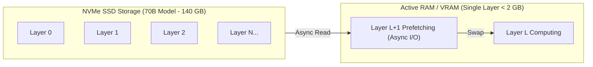
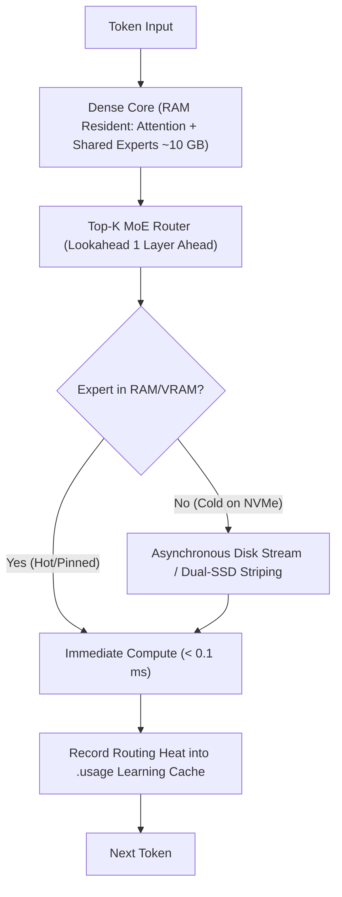

# Research & Architectural Analysis: AirLLM & Colibrì

**Date:** September 2, 2026  
**Sources:**
- **AirLLM**: *Layer-by-Layer Weight Streaming & Asynchronous Prefetching* ([github.com/lyogavin/airllm](https://github.com/lyogavin/airllm))
- **Colibrì**: *Tiny Engine, Immense Model — AI Memory Multitiering & JIT for Weights* ([github.com/JustVugg/colibri](https://github.com/JustVugg/colibri))

---

## 1. What is AirLLM?

### Core Architecture
- **Layer-by-Layer Forward Execution**: Instead of loading hundreds of gigabytes of weights into memory, AirLLM loads only 1 layer at a time, passes the hidden states through, and discards or overwrites the layer buffer.
- **Asynchronous I/O Prefetching**: While layer $L$ is computing on the CPU/GPU, layer $L+1$ is being read from NVMe disk in a background worker thread.
- **Zero Precision Degradation**: Enables running 70B, 405B (Llama 3.1), and 671B (DeepSeek V3) models without aggressive pruning or destructive compression on modest 4 GB–16 GB hardware.

---

## 2. What is Colibrì?

Colibrì is a high-performance C inference engine that runs **frontier 744B to 2.8T parameter MoE models** (like Kimi K3, GLM-5.2, DeepSeek V4) on consumer hardware by treating **VRAM, RAM, and NVMe SSDs as a single unified memory hierarchy**.

### Breakthrough Concepts in Colibrì
1. **"A JIT for Weights"**:
   - In a 744B MoE model, only ~5.4% of parameters (~40B) are active per token, and only ~11 GB of routed experts change between tokens.
   - Weights are **data to be staged**, not permanent resident state.
2. **Workload-Adaptive Learning Cache (`.usage`)**:
   - The engine logs routing frequencies for every expert during user sessions.
   - Automatically pins the hottest experts into RAM for the user's specific domain (e.g. coding, reasoning, translation) — the engine **literally gets faster the more you use it**.
3. **One-Layer-Ahead Lookahead Prefetching**:
   - The router executes one layer ahead of current FFN computation, fetching required expert weights from SSD before the layer starts, hiding disk I/O latency.
4. **Dual-SSD Parallel Striping**:
   - Streams expert weights from two independent SSDs in parallel, doubling effective disk read bandwidth (e.g., 9 GB/s + 3 GB/s = 12 GB/s).
5. **Interactive Web Dashboard (`./coli web`)**:
   - Embedded web interface featuring live token speedometers, per-turn timing breakdowns, VRAM/RAM/disk tier bars, and a live 3D visualizer of all 19,456 routed experts.

---

## 3. How Can AirLLM & Colibrì Supercharge Mivi-v4?

We have identified **3 transformative capabilities** for Mivi:

---

### Area 1: Workload-Adaptive Expert Learning Cache (`.mivi/expert_heat.json`) 🧠
- **How it Works in Mivi**:
  - Mivi's MoE router records per-expert activations into `.mivi/expert_heat.json`.
  - When Mivi boots, it automatically pins the top $N$ most frequently used experts into high-speed memory.
  - As the user works on coding, systems programming, or tool use, Mivi automatically adapts its RAM cache to match their active domains, delivering increasing tok/s throughput over time.

---

### Area 2: Asynchronous Lookahead Weight Prefetching (`mivi-model`) ⚡
- **How it Works in Mivi**:
  - While Mivi executes the attention and SSM scan for layer $L$, a background I/O thread initiates OS prefetching (`madvise(MADV_WILLNEED)` or async channel read) for layer $L+1$'s weights and routed experts.
  - Disk latency is overlapped with CPU compute, eliminating stalls on disk-backed models.

---

### Area 3: Embedded Web Dashboard & Agent Visualizer (`mivi serve --web`) 🌐
- **How it Works in Mivi**:
  - Inspired by Colibrì's sleek `./coli web` interface: Mivi can serve an embedded, single-binary zero-dependency web interface directly at `http://localhost:8913/`.
  - Features:
    - **Real-Time Streaming Chat**: Clean markdown rendering, collapsible `<think>` reasoning traces, and interactive `<tool_call>` execution cards.
    - **Live Engine Telemetry**: Real-time tok/s gauges, TTFT stopwatch, memory tier watermark bars (RAM vs Disk Cache vs TurboQuant), and prefix cache hit ratios.
    - **Memory & Anchor Explorer**: Visual inspector for Open Knowledge Format (OKF) markdown memories, 4-bit TurboQuant vector spaces, and semantic anchor rollback points.

---

## 4. Comparison Matrix

| Feature | Standard Inference | AirLLM | Colibrì | Proposed Mivi-v4 |
|---|---|---|---|---|
| **Memory Model** | Must fit 100% in RAM | Layer-by-Layer Disk Stream | 3-Tier JIT (VRAM/RAM/NVMe) | **Hybrid MoE + RAM Tiering** |
| **I/O Prefetching** | Synchronous | Async Next-Layer | 1-Layer Lookahead + Multi-SSD | **Async Lookahead + `madvise`** |
| **Adaptability** | Static | Static | Workload Learning Cache (`.usage`) | **Workload Heat Cache (`.mivi/`)** |
| **User Interface** | CLI Only | Python Script | CLI + Embedded Web Dashboard | **CLI + Built-in Web UI & Visualizer** |
