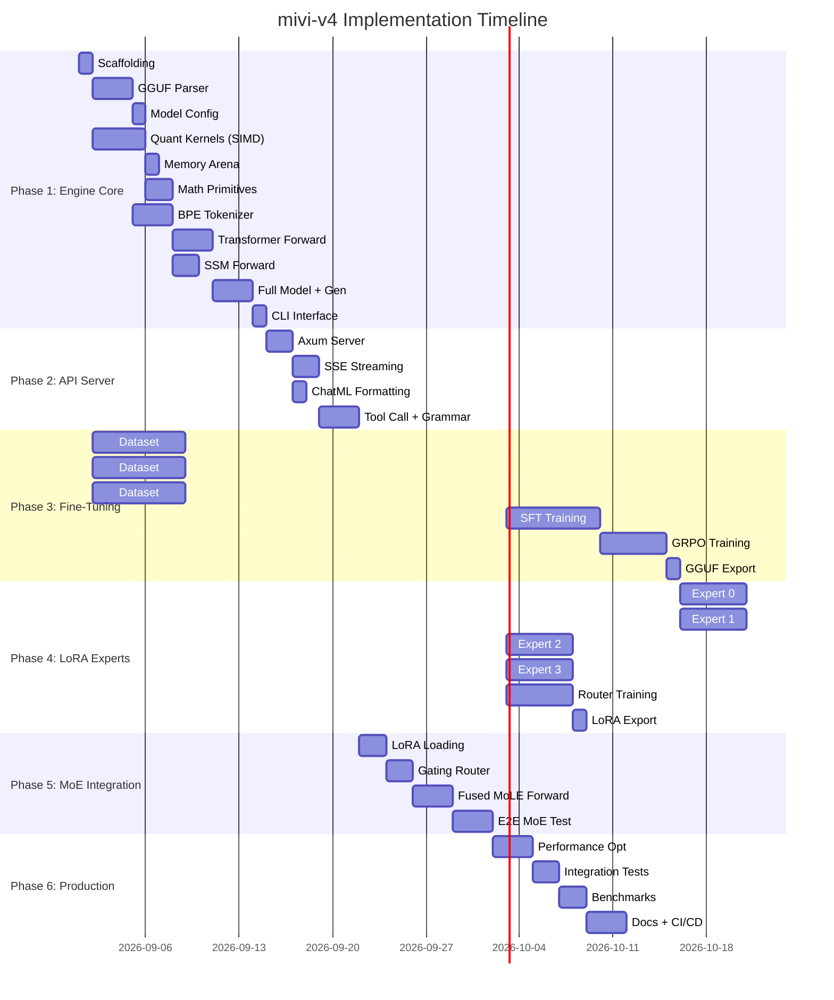

# mivi-v4 — Detailed Implementation Plan

**Version:** 1.0  
**Date:** 2026-08-28  
**Total Duration:** ~14 weeks  
**Phases:** 6  

---

## Phase 1: Rust Engine Core (Weeks 1-3)

> **Goal:** Build a minimal inference engine that can load a GGUF model and generate text from the CLI.

### Task 1.1: Project Scaffolding
**Duration:** Day 1  
**Files:** `Cargo.toml`, `src/main.rs`, all `crates/*/Cargo.toml`

```bash
# Initialize workspace
cargo init --name mivi mivi_v4
cd mivi_v4
mkdir -p crates/{mivi-core,mivi-model,mivi-tokenizer,mivi-server,mivi-router}/src
mkdir -p training/{datasets,sft,grpo,lora,export,eval}
mkdir -p tests benches docs models
```

**Workspace Cargo.toml:**
```toml
[workspace]
members = ["crates/*"]
resolver = "2"

[workspace.dependencies]
half = "2.4"
memmap2 = "0.9"
serde = { version = "1.0", features = ["derive"] }
serde_json = "1.0"
rayon = "1.10"
tracing = "0.1"

[package]
name = "mivi"
version = "0.1.0"
edition = "2024"

[dependencies]
mivi-core = { path = "crates/mivi-core" }
mivi-model = { path = "crates/mivi-model" }
mivi-tokenizer = { path = "crates/mivi-tokenizer" }
mivi-server = { path = "crates/mivi-server", optional = true }
clap = { version = "4", features = ["derive"] }
tracing.workspace = true
tracing-subscriber = "0.3"

[features]
default = ["server"]
server = ["mivi-server"]
```

**Test:** `cargo build` succeeds with empty crates.

---

### Task 1.2: GGUF File Parser
**Duration:** Days 2-4  
**Files:** `crates/mivi-model/src/gguf.rs`  
**Depends on:** 1.1

Parse the GGUF binary format: magic, version, metadata KV pairs, tensor info, compute tensor data offsets.

```rust
// Key data structures
pub struct GgufFile {
    pub metadata: HashMap<String, GgufValue>,
    pub tensors: Vec<TensorInfo>,
    pub data_offset: usize,
    mmap: memmap2::Mmap,
}

pub struct TensorInfo {
    pub name: String,
    pub dims: Vec<usize>,
    pub ggml_type: GgmlType,
    pub offset: usize,  // byte offset from data_offset
}

pub enum GgmlType {
    F32, F16, Q4_0, Q4_K_M, Q5_K_M, Q8_0, // ...
}

pub enum GgufValue {
    U8(u8), I8(i8), U16(u16), I16(i16),
    U32(u32), I32(i32), U64(u64), I64(i64),
    F32(f32), F64(f64), Bool(bool),
    String(String), Array(Vec<GgufValue>),
}
```

**Algorithm:**
1. Read magic bytes, validate `0x46554747`
2. Read version, tensor count, metadata KV count
3. Parse each metadata KV: read key string, value type, value
4. Parse each tensor info: name, n_dims, dims, type, offset
5. Compute aligned data start: `data_offset = align_to_32(current_position)`
6. Memory-map the file: `Mmap::map(&file)`

**Test:** Load `LFM2.5-350M` GGUF, print all metadata keys and tensor shapes.

---

### Task 1.3: Model Configuration
**Duration:** Day 4  
**Files:** `crates/mivi-model/src/config.rs`  
**Depends on:** 1.2

Extract model hyperparameters from GGUF metadata.

```rust
pub struct ModelConfig {
    pub dim: usize,            // embedding dimension (1024)
    pub hidden_dim: usize,     // FFN hidden dim (2816)
    pub n_layers: usize,       // total blocks (24)
    pub n_heads: usize,        // query heads (16)
    pub n_kv_heads: usize,     // key-value heads (4)
    pub head_dim: usize,       // dim / n_heads (64)
    pub kv_dim: usize,         // n_kv_heads * head_dim (256)
    pub vocab_size: usize,     // vocabulary (65536)
    pub max_seq_len: usize,    // max context (32768)
    pub rope_base: f32,        // RoPE frequency base (1e6)
    pub block_types: Vec<BlockType>, // SSM or Attention per block
}

pub enum BlockType { SSM, Attention }
```

**Test:** Parse config from GGUF, assert `dim == 1024`, `n_layers == 24`.

---

### Task 1.4: Quantization Kernels
**Duration:** Days 5-8  
**Files:** `crates/mivi-core/src/quantize.rs`, `crates/mivi-core/src/simd/`  
**Depends on:** 1.1

Implement dequantization and matrix-vector multiplication for Q4_K_M and Q8_0.

```rust
// Q4_K_M block layout (144 bytes per 256 elements)
#[repr(C, packed)]
pub struct BlockQ4KM {
    pub d: u16,          // f16 super-block scale
    pub dmin: u16,       // f16 super-block minimum
    pub scales: [u8; 12], // 8 sub-block scales (6-bit packed)
    pub qs: [u8; 128],   // 256 4-bit weights packed
}

/// Matrix-vector multiply: out[n] = weights[n, d] · x[d]
/// weights in Q4_K_M format, x and out in f32
pub fn matvec_q4km(
    out: &mut [f32],     // [n]
    weights: &[u8],      // raw Q4_K_M bytes
    x: &[f32],           // [d]
    n: usize,            // output dim
    d: usize,            // input dim
);
```

**SIMD dispatch pattern:**
```rust
// crates/mivi-core/src/simd/mod.rs
#[cfg(target_arch = "x86_64")]
pub mod avx2;
#[cfg(target_arch = "aarch64")]
pub mod neon;
pub mod scalar;

pub fn matvec_q4km(out: &mut [f32], w: &[u8], x: &[f32], n: usize, d: usize) {
    #[cfg(target_arch = "x86_64")]
    if is_x86_feature_detected!("avx2") {
        return unsafe { avx2::matvec_q4km(out, w, x, n, d) };
    }
    #[cfg(target_arch = "aarch64")]
    return unsafe { neon::matvec_q4km(out, w, x, n, d) };
    scalar::matvec_q4km(out, w, x, n, d)
}
```

**Test:** Dequantize a Q4_K_M block, verify values match Python reference. Benchmark matvec throughput.

---

### Task 1.5: Memory Arena (RunState)
**Duration:** Day 8  
**Files:** `crates/mivi-core/src/arena.rs`  
**Depends on:** 1.3

Pre-allocate all inference buffers based on model config. Zero allocations during decode.

```rust
impl RunState {
    pub fn new(c: &ModelConfig) -> Self {
        let n_attn_layers = c.block_types.iter()
            .filter(|b| matches!(b, BlockType::Attention)).count();
        
        Self {
            x: vec![0.0f32; c.dim].into_boxed_slice(),
            xb: vec![0.0f32; c.dim].into_boxed_slice(),
            // ... all other buffers ...
            key_cache: vec![0.0f32; n_attn_layers * c.max_seq_len * c.kv_dim]
                .into_boxed_slice(),
            value_cache: vec![0.0f32; n_attn_layers * c.max_seq_len * c.kv_dim]
                .into_boxed_slice(),
        }
    }
    
    /// Reset state for a new conversation
    pub fn reset(&mut self) {
        self.key_cache.fill(0.0);
        self.value_cache.fill(0.0);
    }
}
```

**Test:** Create RunState, verify total allocated bytes matches expected budget.

---

### Task 1.6: Math Primitives
**Duration:** Days 9-10  
**Files:** `crates/mivi-core/src/math.rs`  
**Depends on:** 1.4

```rust
/// RMS Normalization: y = x * weight / rms(x)
pub fn rms_norm(out: &mut [f32], x: &[f32], weight: &[f32], eps: f32);

/// Softmax in-place
pub fn softmax(x: &mut [f32]);

/// SiLU activation: x * sigmoid(x)
pub fn silu(x: &mut [f32]);

/// Element-wise multiply: out = a * b
pub fn elementwise_mul(out: &mut [f32], a: &[f32], b: &[f32]);

/// Vector dot product
pub fn dot(a: &[f32], b: &[f32]) -> f32;

/// Vector add: out += src
pub fn vec_add(out: &mut [f32], src: &[f32]);
```

**Test:** Compare outputs against NumPy reference values with tolerance 1e-5.

---

### Task 1.7: BPE Tokenizer
**Duration:** Days 10-12  
**Files:** `crates/mivi-tokenizer/src/`  
**Depends on:** 1.2

Load tokenizer from GGUF metadata or external vocab file.

```rust
pub struct Tokenizer {
    vocab: Vec<String>,         // token_id → string
    merges: Vec<(u32, u32)>,    // merge pairs
    token_to_id: HashMap<Vec<u8>, u32>,
    special_tokens: HashMap<String, u32>, // <think>, <tool_call>, etc.
}

impl Tokenizer {
    pub fn from_gguf(gguf: &GgufFile) -> Self;
    pub fn encode(&self, text: &str) -> Vec<u32>;
    pub fn decode(&self, ids: &[u32]) -> String;
    pub fn decode_token(&self, id: u32) -> &str;
}
```

**Test:** Encode/decode roundtrip on sample text. Verify special token IDs.

---

### Task 1.8: Transformer Forward Pass
**Duration:** Days 12-15  
**Files:** `crates/mivi-model/src/transformer.rs`, `ffn.rs`, `norm.rs`, `rope.rs`  
**Depends on:** 1.4, 1.5, 1.6

Implement GQA attention block:
1. RMSNorm
2. Q/K/V projection (quantized matvec)
3. RoPE application
4. KV cache update
5. Attention scores with GQA head broadcast
6. Weighted sum of values
7. Output projection

**Test:** Forward pass on a single attention layer, verify output shape.

---

### Task 1.9: SSM Block Forward Pass
**Duration:** Days 15-17  
**Files:** `crates/mivi-model/src/ssm.rs`  
**Depends on:** 1.6, 1.8

Implement the state-space model block for LFM hybrid layers:
1. Conv1D over input
2. Gate projection + SiLU
3. Recurrent update: `h = A*h + B*x`
4. Output: `y = C*h`
5. Gated output: `y = y ⊙ gate`
6. Output projection

```rust
pub struct SsmState {
    pub h: Vec<f32>,  // hidden state [state_dim]
}

pub fn ssm_forward(
    out: &mut [f32],
    x: &[f32],
    state: &mut SsmState,
    weights: &SsmWeights,
    config: &ModelConfig,
);
```

**Test:** Verify SSM produces non-zero output and state updates correctly.

---

### Task 1.10: Full Model Forward + Generation Loop
**Duration:** Days 17-19  
**Files:** `crates/mivi-model/src/model.rs`, `sampler.rs`  
**Depends on:** 1.7, 1.8, 1.9

```rust
pub struct Model {
    pub config: ModelConfig,
    pub gguf: GgufFile,
    pub state: RunState,
    pub tokenizer: Tokenizer,
}

impl Model {
    pub fn load(path: &Path) -> Result<Self>;
    
    /// Forward pass for a single token at a given position
    pub fn forward(&mut self, token: u32, pos: usize) -> &[f32]; // returns logits
    
    /// Generate text from a prompt
    pub fn generate(&mut self, prompt: &str, max_tokens: usize) -> String;
}
```

**Sampler:**
```rust
pub struct Sampler {
    pub temperature: f32,
    pub top_p: f32,
    pub top_k: usize,
    pub repetition_penalty: f32,
}

impl Sampler {
    pub fn sample(&self, logits: &mut [f32], recent_tokens: &[u32]) -> u32;
}
```

**Test:** Load LFM2.5-350M GGUF, generate 50 tokens from "Hello, my name is". Verify coherent output.

---

### Task 1.11: CLI Interface
**Duration:** Day 20  
**Files:** `src/main.rs`  
**Depends on:** 1.10

```rust
#[derive(Parser)]
#[command(name = "mivi", about = "mivi-v4 Agentic SLM Engine")]
enum Cli {
    /// Start the HTTP API server
    Serve {
        #[arg(long)]
        model: PathBuf,
        #[arg(long, default_value = "8080")]
        port: u16,
        #[arg(long, default_value = "127.0.0.1")]
        host: String,
    },
    /// Interactive chat in terminal
    Chat {
        #[arg(long)]
        model: PathBuf,
    },
    /// Display model information
    Info {
        #[arg(long)]
        model: PathBuf,
    },
}
```

**Test:** `cargo run -- chat --model ./models/lfm2.5-350m-q4km.gguf`

---

## Phase 2: HTTP API Server (Week 4)

> **Goal:** Wrap the engine in an OpenAI-compatible streaming HTTP API.

### Task 2.1: Axum Server Setup
**Duration:** Days 21-22  
**Files:** `crates/mivi-server/src/lib.rs`, `api.rs`, `types.rs`  
**Depends on:** 1.10

```rust
pub async fn start_server(config: ServerConfig) -> Result<()> {
    let (cmd_tx, cmd_rx) = tokio::sync::mpsc::channel::<InferenceCommand>(32);
    
    // Spawn dedicated inference worker on a blocking thread
    let model_path = config.model_path.clone();
    std::thread::spawn(move || {
        let mut model = Model::load(&model_path).unwrap();
        inference_worker(&mut model, cmd_rx);
    });
    
    let app = Router::new()
        .route("/v1/chat/completions", post(chat_completions))
        .route("/v1/models", get(list_models))
        .route("/health", get(health_check))
        .layer(Extension(cmd_tx))
        .layer(CorsLayer::permissive());
    
    let listener = TcpListener::bind(format!("{}:{}", config.host, config.port)).await?;
    axum::serve(listener, app).await?;
    Ok(())
}
```

**Test:** Start server, `curl /health` returns 200.

---

### Task 2.2: SSE Streaming
**Duration:** Days 22-23  
**Files:** `crates/mivi-server/src/streaming.rs`  
**Depends on:** 2.1

Bridge sync inference → async SSE via mpsc channels:

```rust
pub async fn chat_completions(
    Extension(cmd_tx): Extension<mpsc::Sender<InferenceCommand>>,
    Json(req): Json<ChatCompletionRequest>,
) -> Result<Sse<impl Stream<Item = Result<Event, Infallible>>>, ApiError> {
    let (token_tx, token_rx) = mpsc::channel::<GenerationEvent>(64);
    
    cmd_tx.send(InferenceCommand {
        messages: req.messages,
        tools: req.tools,
        sampler: Sampler::from_request(&req),
        response_tx: token_tx,
    }).await?;
    
    let stream = ReceiverStream::new(token_rx).map(|event| {
        let chunk = match event {
            GenerationEvent::Token(text) => format_chunk(text, None),
            GenerationEvent::Thinking(text) => format_chunk_thinking(text),
            GenerationEvent::ToolCall(tc) => format_tool_call_chunk(tc),
            GenerationEvent::Done(reason) => format_done(reason),
        };
        Ok(Event::default().data(serde_json::to_string(&chunk).unwrap()))
    });
    
    Ok(Sse::new(stream).keep_alive(KeepAlive::default()))
}
```

**Test:** Stream 20 tokens from API, verify SSE format matches OpenAI spec.

---

### Task 2.3: ChatML Prompt Formatting
**Duration:** Day 23  
**Files:** `crates/mivi-server/src/prompt.rs`  
**Depends on:** 2.1

Convert OpenAI messages → ChatML string with tool definitions:

```rust
pub fn format_chatml(
    messages: &[Message],
    tools: Option<&[Tool]>,
    thinking: bool,
) -> String {
    let mut prompt = String::new();
    
    // System message with tool definitions
    if let Some(sys) = messages.iter().find(|m| m.role == Role::System) {
        prompt.push_str("<|im_start|>system\n");
        prompt.push_str(&sys.content.as_deref().unwrap_or(""));
        if let Some(tools) = tools {
            prompt.push_str("\n<tools>\n");
            prompt.push_str(&serde_json::to_string_pretty(tools).unwrap());
            prompt.push_str("\n</tools>");
            prompt.push_str("\nTo call a tool: <tool_call>{\"name\":\"...\",\"arguments\":{...}}</tool_call>");
        }
        if thinking {
            prompt.push_str("\nThink step-by-step inside <think>...</think> before responding.");
        }
        prompt.push_str("\n<|im_end|>\n");
    }
    
    // Remaining messages
    for msg in messages.iter().filter(|m| m.role != Role::System) {
        prompt.push_str(&format!("<|im_start|>{}\n", msg.role));
        // Handle tool results, tool calls, content...
        prompt.push_str("<|im_end|>\n");
    }
    
    prompt.push_str("<|im_start|>assistant\n");
    prompt
}
```

**Test:** Format a multi-turn conversation with tools, verify output matches expected ChatML.

---

### Task 2.4: Tool Call Detection & Grammar Constraint
**Duration:** Days 24-26  
**Files:** `crates/mivi-server/src/tool_call.rs`, `grammar.rs`  
**Depends on:** 2.2

**State machine for tool call detection** (runs on the streamed token output):

```rust
pub enum StreamState {
    Normal,
    MaybeThinkOpen { buffer: String },
    InsideThink,
    MaybeThinkClose { buffer: String },
    MaybeToolOpen { buffer: String },
    InsideToolCall { json_buffer: String, brace_depth: i32 },
    MaybeToolClose { buffer: String, json: String },
}

impl StreamState {
    pub fn feed_token(&mut self, token: &str) -> Vec<GenerationEvent> {
        // Returns events: TextChunk, ThinkingChunk, ToolCallComplete, etc.
    }
}
```

**Grammar-constrained decoding** (runs before sampling, masks logits):

```rust
pub struct JsonGrammar {
    state_stack: Vec<JsonState>,
    valid_tokens: BitVec,  // [vocab_size] bitmask
}

enum JsonState {
    ExpectObjectStart,
    ExpectKey,
    ExpectColon,
    ExpectValue,
    ExpectCommaOrEnd,
    InsideString { escaped: bool },
    InsideNumber,
    // ...
}

impl JsonGrammar {
    /// Mask logits for invalid next tokens
    pub fn apply_mask(&self, logits: &mut [f32], tokenizer: &Tokenizer) {
        for (id, logit) in logits.iter_mut().enumerate() {
            if !self.is_valid_next_token(id as u32, tokenizer) {
                *logit = f32::NEG_INFINITY;
            }
        }
    }
}
```

**Test:** Generate 100 tool calls, verify 100% valid JSON. Compare with/without grammar constraint.

---

## Phase 3: Base Model Fine-Tuning (Weeks 5-7)

> **Goal:** Fine-tune LFM2.5-350M for agentic capabilities.

### Task 3.1: Dataset Curation — Tool Calling
**Duration:** Week 5  
**Files:** `training/datasets/prepare_tool_calling.py`

**Data sources:**
- ToolBench API calls → ChatML format
- BFCL (Berkeley Function Calling Leaderboard) train set
- Synthetic: generate tool schemas → have GPT-4 produce valid calls → verify execution
- Custom: 50+ tool schemas covering search, code, files, databases, APIs

**Format per example:**
```json
{
  "messages": [
    {"role": "system", "content": "You are MIVI... <tools>[...]</tools>"},
    {"role": "user", "content": "Search for Rust tutorials"},
    {"role": "assistant", "content": "<think>I should use web_search for this.</think>\n<tool_call>{\"name\":\"web_search\",\"arguments\":{\"query\":\"Rust programming tutorials 2026\"}}</tool_call>"},
    {"role": "tool", "content": "{\"results\": [...]}"},
    {"role": "assistant", "content": "Here are some great Rust tutorials..."}
  ]
}
```

**Target:** 50K+ tool calling examples.

---

### Task 3.2: Dataset Curation — Thinking/Reasoning
**Duration:** Week 5 (parallel with 3.1)  
**Files:** `training/datasets/prepare_thinking.py`

**Data sources:**
- DeepSeek-R1 distillation (thinking traces)
- GSM8K + MATH with step-by-step solutions wrapped in `<think>` tags
- Synthetic: problems → verbose reasoning → compressed reasoning (ThinkingCap approach)

**Target:** 30K+ thinking examples with varying think lengths.

---

### Task 3.3: Dataset Curation — Agentic Conversations
**Duration:** Week 5 (parallel)  
**Files:** `training/datasets/prepare_agentic.py`

**Data sources:**
- Multi-turn agent conversations with tool use
- Error recovery examples (tool fails → model retries)
- Routing decisions ("I know this" vs "I need to search")
- Agent memory/context management examples

**Target:** 20K+ agentic examples.

---

### Task 3.4: SFT Training
**Duration:** Week 6  
**Files:** `training/sft/train_sft.py`

```python
from transformers import AutoModelForCausalLM, AutoTokenizer
from trl import SFTTrainer, SFTConfig

model = AutoModelForCausalLM.from_pretrained("LiquidAI/LFM2.5-350M")
tokenizer = AutoTokenizer.from_pretrained("LiquidAI/LFM2.5-350M")

# Combine all datasets
dataset = load_combined_dataset([
    "data/tool_calling.jsonl",   # 50K
    "data/thinking.jsonl",       # 30K
    "data/agentic.jsonl",        # 20K
    "data/chat.jsonl",           # 20K
])

trainer = SFTTrainer(
    model=model,
    train_dataset=dataset,
    args=SFTConfig(
        output_dir="./checkpoints/mivi-v4-sft",
        num_train_epochs=3,
        per_device_train_batch_size=4,
        gradient_accumulation_steps=8,
        learning_rate=2e-5,
        warmup_ratio=0.1,
        bf16=True,
        max_seq_length=4096,
    ),
)
trainer.train()
```

**Test:** Evaluate on held-out tool calling examples, target >60% accuracy.

---

### Task 3.5: GRPO Reinforcement Learning
**Duration:** Week 7  
**Files:** `training/grpo/train_grpo.py`

Apply ToolOrchestra-style GRPO with deterministic rewards:

```python
from trl import GRPOTrainer, GRPOConfig

def reward_function(completions, prompts):
    rewards = []
    for completion in completions:
        r = 0.0
        # Format reward: proper <think> and <tool_call> tags
        r += 0.2 if has_valid_tags(completion) else -0.5
        # Correctness: valid JSON in tool calls
        r += 0.3 if has_valid_json(completion) else -0.3
        # Execution: tool call produces correct result
        r += 0.5 if execute_and_verify(completion) else 0.0
        # Efficiency: penalize excessive thinking
        think_tokens = count_think_tokens(completion)
        r -= 0.1 * max(0, think_tokens - 50) / 50
        rewards.append(r)
    return rewards

trainer = GRPOTrainer(
    model=sft_model,
    reward_funcs=[reward_function],
    args=GRPOConfig(
        output_dir="./checkpoints/mivi-v4-grpo",
        num_train_epochs=1,
        per_device_train_batch_size=2,
        num_generations=4,  # group size
        learning_rate=1e-6,
        bf16=True,
    ),
)
```

---

### Task 3.6: GGUF Export
**Duration:** Day (end of week 7)  
**Files:** `training/export/export_gguf.py`

```bash
# Convert to GGUF using llama.cpp
python convert_hf_to_gguf.py \
    ./checkpoints/mivi-v4-grpo \
    --outfile ./models/mivi-v4-base.gguf \
    --outtype q4_k_m
```

**Test:** Load exported GGUF in mivi engine, verify generation quality.

---

## Phase 4: LoRA Expert Training (Weeks 8-10)

> **Goal:** Train 4 specialized LoRA adapters + router gating weights.

### Task 4.1: Expert 0 — Reasoning LoRA
**Duration:** Week 8  
**Files:** `training/lora/train_reasoning.py`

```python
from peft import LoraConfig, get_peft_model

lora_config = LoraConfig(
    r=32,
    lora_alpha=64,
    target_modules=["q_proj", "k_proj", "v_proj", "o_proj", 
                     "gate_proj", "up_proj", "down_proj"],
    lora_dropout=0.05,
    task_type="CAUSAL_LM",
)

# Train on: DeepSeek-R1 CoT, math, logic, step-by-step reasoning
# Focus: <think> block quality, multi-step derivations
```

### Task 4.2: Expert 1 — Code + Tools LoRA
**Duration:** Week 8 (parallel)  
Train on: ToolBench, BFCL, HumanEval, code-alpaca, JSON schemas

### Task 4.3: Expert 2 — Agentic Orchestration LoRA
**Duration:** Week 9  
Train on: Agent trajectories, routing decisions, memory management, multi-step planning

### Task 4.4: Expert 3 — Chat + Format LoRA
**Duration:** Week 9 (parallel)  
Train on: ShareGPT, UltraChat, formatting tasks, summarization

### Task 4.5: Router Gating Training
**Duration:** Week 10  
**Files:** `training/router/train_router.py`

Train a small gating network that routes tokens to the correct experts:

```python
# Per-layer gating weights: W_g ∈ R^{dim × n_experts}
# Trained on balanced mixture of all expert domains
# with auxiliary load-balancing loss

# Loss = L_task + α * L_aux
# L_aux = N * Σ (fraction_routed_i × avg_gate_prob_i)
```

### Task 4.6: LoRA → GGUF Export
Export each LoRA adapter to a compact binary format loadable by the Rust engine:

```
lora_expert_0_reasoning.bin
lora_expert_1_code_tools.bin
lora_expert_2_agentic.bin
lora_expert_3_chat.bin
router_weights.bin
```

---

## Phase 5: MoE Integration in Rust Engine (Weeks 11-12)

> **Goal:** Add LoRA MoLE inference to the Rust engine.

### Task 5.1: LoRA Adapter Loading
**Duration:** Days 1-2 (Week 11)  
**Files:** `crates/mivi-model/src/lora.rs`  
**Depends on:** Phase 1, Phase 4

```rust
pub struct LoraAdapter {
    pub name: String,
    pub rank: usize,
    pub alpha: f32,
    /// A matrices: [n_layers][target_module] → [rank, dim] FP16
    pub a_weights: Vec<HashMap<String, Vec<f16>>>,
    /// B matrices: [n_layers][target_module] → [dim, rank] FP16
    pub b_weights: Vec<HashMap<String, Vec<f16>>>,
}

impl LoraAdapter {
    pub fn load(path: &Path) -> Result<Self>;
    
    /// Compute LoRA contribution: (α/r) * B(Ax)
    pub fn forward(
        &self, 
        layer: usize, 
        module: &str,
        x: &[f32], 
        scratch_down: &mut [f32],  // [rank] 
        scratch_up: &mut [f32],    // [dim]
    );
}
```

---

### Task 5.2: Top-K Gating Router
**Duration:** Days 3-4 (Week 11)  
**Files:** `crates/mivi-model/src/moe.rs`

```rust
pub struct MoeRouter {
    /// Gating weights per layer: [n_layers][dim, n_experts]
    pub gate_weights: Vec<Vec<f32>>,
    pub n_experts: usize,
    pub top_k: usize,  // 2
}

impl MoeRouter {
    /// Compute top-k expert gates for input x
    pub fn route(&self, layer: usize, x: &[f32]) -> Vec<(usize, f32)> {
        // gate_logits = W_gate · x
        let mut logits = vec![0.0f32; self.n_experts];
        matvec_f32(&mut logits, &self.gate_weights[layer], x, self.n_experts, x.len());
        
        // Top-K selection
        let mut indices: Vec<usize> = (0..self.n_experts).collect();
        indices.sort_by(|&a, &b| logits[b].partial_cmp(&logits[a]).unwrap());
        indices.truncate(self.top_k);
        
        // Softmax over selected experts
        let max_logit = logits[indices[0]];
        let sum: f32 = indices.iter().map(|&i| (logits[i] - max_logit).exp()).sum();
        
        indices.iter().map(|&i| {
            (i, (logits[i] - max_logit).exp() / sum)
        }).collect()
    }
}
```

---

### Task 5.3: Fused MoLE Forward Pass
**Duration:** Days 5-7 (Week 11)  
**Files:** Update `crates/mivi-model/src/model.rs`

Integrate LoRA experts into the main forward pass:

```rust
// Inside the layer forward pass, after computing base output y:
if let Some(moe) = &self.moe {
    let experts = moe.router.route(layer_idx, &state.x);
    
    for (expert_id, gate_weight) in experts {
        let adapter = &moe.adapters[expert_id];
        
        // Compute LoRA: (α/r) * B(A(x))
        adapter.forward(
            layer_idx, 
            "q_proj",  // repeat for each target module
            &state.x,
            &mut state.lora_down,
            &mut state.lora_up,
        );
        
        // Accumulate: y += gate_weight * lora_output
        for i in 0..y.len() {
            y[i] += gate_weight * state.lora_up[i];
        }
    }
}
```

---

### Task 5.4: End-to-End MoE Test
**Duration:** Days 8-10 (Week 12)

**Tests:**
1. Load base model + 4 LoRA adapters + router weights
2. Generate text with MoE active, verify quality
3. Compare: base-only vs MoE on tool calling benchmark
4. Measure: memory usage (should be <500MB total)
5. Measure: latency overhead of LoRA computation (<10% slowdown)
6. Verify: expert utilization distribution (all experts used)

---

## Phase 6: Production Hardening (Weeks 13-14)

> **Goal:** Polish, optimize, benchmark, document.

### Task 6.1: Performance Optimization
- Profile with `perf` / `cargo flamegraph`
- Optimize hot loops (matvec, attention, RoPE)
- Reduce cache misses with data layout optimization
- Verify zero allocations in decode loop with custom allocator

### Task 6.2: Integration Tests
```rust
#[tokio::test]
async fn test_basic_chat() {
    let server = start_test_server().await;
    let resp = server.post("/v1/chat/completions")
        .json(&json!({
            "model": "mivi-v4",
            "messages": [{"role": "user", "content": "Hello!"}],
            "max_tokens": 50
        }))
        .send().await;
    assert_eq!(resp.status(), 200);
}

#[tokio::test]
async fn test_tool_calling() {
    // Verify tool call JSON is always valid
}

#[tokio::test]
async fn test_thinking() {
    // Verify <think> blocks are properly detected and streamed
}

#[tokio::test]
async fn test_memory_budget() {
    // Verify RSS < 500MB after loading model + LoRAs
}
```

### Task 6.3: Benchmarks
```bash
mivi bench --model ./models/mivi-v4.gguf
# Output:
# Model: mivi-v4 (350M params, Q4_K_M)
# Weights: 195 MB
# Peak RSS: 342 MB
# Prefill: 145 tok/s (1024 token prompt)
# Decode:  22 tok/s (avg over 100 tokens)
# TTFT:    380 ms
# Tool call JSON validity: 98.5%
```

### Task 6.4: Documentation
- `docs/architecture.md` — system architecture guide
- `docs/api-reference.md` — full API documentation
- `docs/training-guide.md` — how to fine-tune your own experts
- `README.md` — getting started, quick install, usage

### Task 6.5: CI/CD
```yaml
# .github/workflows/ci.yml
- cargo test --all
- cargo clippy --all -- -D warnings
- cargo build --release --target x86_64-unknown-linux-gnu
- cargo build --release --target aarch64-unknown-linux-gnu
```

### Task 6.6: Release Binary
```bash
# Build static binary
RUSTFLAGS="-C target-cpu=native -C link-arg=-s" \
    cargo build --release

# Result: target/release/mivi (~15-20MB)
```

---

## Dependency Graph



---

## Quick Start (After Implementation)

```bash
# Install
cargo install mivi

# Download model
wget https://huggingface.co/mivi/mivi-v4/resolve/main/mivi-v4-q4km.gguf

# Serve
mivi serve --model mivi-v4-q4km.gguf --port 8080

# Use from any agent
curl http://localhost:8080/v1/chat/completions \
  -H "Content-Type: application/json" \
  -d '{
    "model": "mivi-v4",
    "messages": [{"role": "user", "content": "Hello!"}],
    "stream": true
  }'
```
