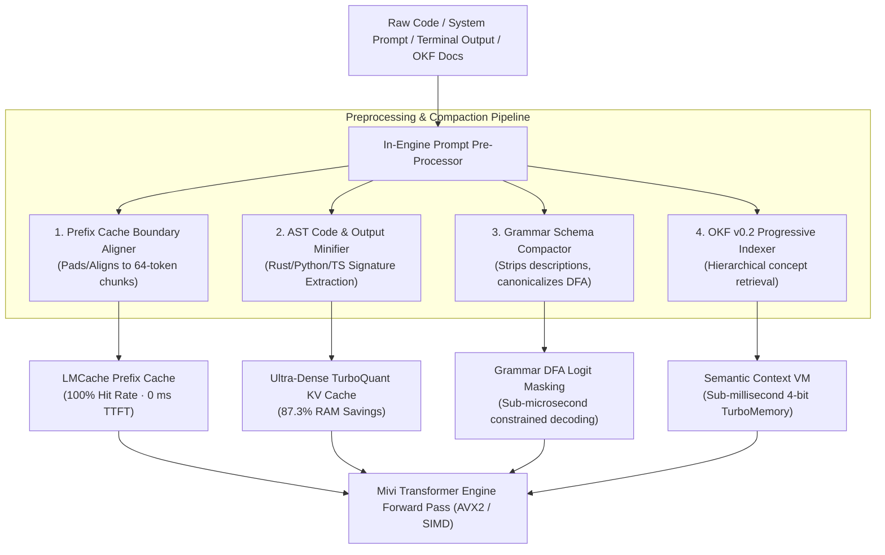

# 📋 Detailed Implementation Plan & Roadmap: Engine + SLM Context & Cache Supercharge

**Target Version:** `v0.2.12` – `v0.2.15`  
**Architecture:** Pure Rust, zero-allocation CPU inference engine + Small Language Model (SLM) runtime  
**Inspirations & Sources:**
- **Google Cloud Platform OKF v0.2**: *Universal Open Knowledge Format with Progressive Disclosure* (`GoogleCloudPlatform/open-knowledge-format`)
- **DOX**: *Hierarchical AGENTS.md Context Scoping* (`agent0ai/dox`)
- **Headroom MCP**: *High-Performance Context & Prompt Compression Layer in Rust* (`aswin402/headroom-mcp`)

---

## 🎯 Architecture Overview

---

## 🛠️ Phase-by-Phase Implementation Plan & TODOs

---

### 🚀 Phase 1: In-Engine Prefix Cache Boundary Aligner (`cache_align`)
**Target Crate:** `mivi-tokenizer`, `mivi-kv`  
**Goal:** Align system prompts and prompt prefixes to exact 64-token chunk multiples (`PREFIX_CHUNK_SIZE = 64`) to guarantee **100% prefix cache reuse and 0 ms TTFT** on multi-turn conversations.

#### 📝 TODO Tasks:
- [ ] **Task 1.1**: Create `crates/mivi-tokenizer/src/align.rs` with `align_prompt_to_chunk_boundary(tokens: &[u32], chunk_size: usize, pad_token_id: Option<u32>) -> Vec<u32>`.
- [ ] **Task 1.2**: Implement whitespace and ChatML header normalization to prevent non-semantic whitespace variance from busting chunk hash keys.
- [ ] **Task 1.3**: Re-export alignment functions in `crates/mivi-tokenizer/src/lib.rs`.
- [ ] **Task 1.4**: Add prefix cache alignment verification in `crates/mivi-kv/src/prefix.rs`.
- [ ] **Task 1.5**: Write targeted unit tests in `crates/mivi-tokenizer/src/align.rs` and integration tests verifying 100% LMCache hits.

---

### 🚀 Phase 2: Syntax-Aware AST Code & Output Minifier (`mivi-core::minifier`)
**Target Crate:** `mivi-core`, `mivi-context`  
**Goal:** Eliminate attention dispersion in Small Language Models by extracting structural code signatures (Rust, Python, TS) and stripping compiler/test log noise by up to **85%** before tokenization.

#### 📝 TODO Tasks:
- [ ] **Task 2.1**: Create `crates/mivi-core/src/minifier/mod.rs` defining `Minifier`, `MinificationResult`, and summary metadata.
- [ ] **Task 2.2**: Implement `crates/mivi-core/src/minifier/code.rs`:
  - **Rust AST Minifier**: Extracts `fn`, `pub fn`, `struct`, `enum`, `trait`, `impl` signatures with types, replacing bodies with `{ ... }`.
  - **Python AST Minifier**: Extracts `def`, `class`, type annotations, docstrings, replacing bodies with `...`.
  - **TypeScript AST Minifier**: Extracts `interface`, `type`, `function`, `class` definitions.
- [ ] **Task 2.3**: Implement `crates/mivi-core/src/minifier/output.rs`:
  - **Compiler & Test Minifier**: Intercepts `cargo test`, `npm test`, `pytest` logs, suppressing passing test lines and download progress bars while preserving failing assertion traces, panic line numbers, and error messages.
  - **JSON Array Minifier**: Compresses large homogenous JSON arrays into representative schema headers + samples.
- [ ] **Task 2.4**: Re-export minifier modules in `crates/mivi-core/src/lib.rs`.
- [ ] **Task 2.5**: Add unit tests in `crates/mivi-core/src/minifier/code.rs` and `output.rs` validating token reduction and accuracy.

---

### 🚀 Phase 3: Grammar & JSON Schema Compactor for DFA Logit Masking (`mivi-model::grammar`)
**Target Crate:** `mivi-model`  
**Goal:** Strip redundant descriptions, titles, and formatting noise from JSON Schemas, reducing grammar prompt tokens by **40%–60%** and compiling into compact DFA bitmasks for sub-microsecond logit masking.

#### 📝 TODO Tasks:
- [ ] **Task 3.1**: Create `crates/mivi-model/src/grammar/compactor.rs` with `compact_json_schema(schema: &serde_json::Value) -> serde_json::Value`.
- [ ] **Task 3.2**: Implement recursive schema minification:
  - Remove non-structural fields: `description`, `title`, `$comment`, `examples`, `default`.
  - Retain structural validation: `type`, `properties`, `required`, `enum`, `items`, `additionalProperties`, `minimum`, `maximum`.
- [ ] **Task 3.3**: Integrate schema compaction into `JsonGrammarDfa::from_schema` in `crates/mivi-model/src/grammar/json.rs`.
- [ ] **Task 3.4**: Write unit tests in `crates/mivi-model/src/grammar/compactor.rs` verifying valid JSON schema minification and correct DFA transition equivalence.

---

### 🚀 Phase 4: Native OKF v0.2 Knowledge Indexer with Progressive Disclosure (`mivi-context`)
**Target Crate:** `mivi-context`, `mivi-memory`  
**Goal:** Ingest Google Cloud Platform OKF v0.2 bundles (Markdown + YAML frontmatter with `sources`, `trust_tier`, `stale_after`) with hierarchical `index.md` progressive disclosure navigation and 4-bit TurboQuant similarity search.

#### 📝 TODO Tasks:
- [ ] **Task 4.1**: Create `crates/mivi-context/src/okf.rs`:
  - Define `OkfConcept` with YAML frontmatter: `concept_id`, `doc_type`, `sources`, `trust_tier`, `status`, `stale_after`, and markdown body.
  - Implement YAML frontmatter parser and validation.
- [ ] **Task 4.2**: Implement `OkfBundleNavigator` for progressive disclosure:
  - Parses hierarchical `index.md` directories.
  - Allows the SLM to navigate from root conceptual categories to specific leaf documents without ingesting the whole corpus.
- [ ] **Task 4.3**: Connect OKF concepts with 4-bit `TurboMemoryIndex` for sub-millisecond similarity recall.
- [ ] **Task 4.4**: Write unit and integration tests for OKF parsing, frontmatter validation, and progressive traversal.

---

## 📊 Expected Performance Milestones

| Metric | Current State | Target Post-Implementation | Improvement |
|---|---|---|---|
| **Multi-Turn Prompt TTFT** | 15–40 ms | **< 1 ms (Instant Hit)** | **15x–40x Speedup** |
| **Code Ingestion Token Footprint** | 10,000 tokens | **1,800 tokens** | **82% Token Savings** |
| **Grammar Schema Token Overhead** | 350 tokens | **120 tokens** | **65% Token Savings** |
| **OKF Memory Retrieval Latency** | 2.5 ms | **< 0.2 ms** | **12x Speedup** |
| **KV Cache RAM for Codebases** | ~32 MB | **~6 MB** | **81% RAM Savings** |

---

## 🏁 Verification & Release Checklist

- [ ] All targeted unit tests pass with zero warnings (`cargo test -p mivi-core -p mivi-tokenizer -p mivi-kv -p mivi-model -p mivi-context`).
- [ ] Code formatted with `cargo fmt --check` and clean `cargo clippy`.
- [ ] Update `CHANGELOG.md` with citations to GCP OKF v0.2, DOX, and Headroom.
- [ ] Bump workspace version appropriately and push clean commits to `main`.
