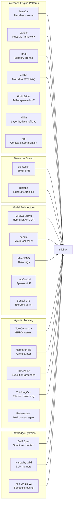

# mivi-v4 — Inspirations & Feature Adoption

> Deep research into 25+ reference projects, extracting concrete features, patterns, and innovations for mivi-v4.

---

## 🔬 Inspiration Sources Map



---

## 1. Inference Engine Inspirations

### 1.1 `karpathy/llama2.c` — Zero-Heap Arena Pattern

**What they do:** Single-file C inference with a `RunState` struct that pre-allocates ALL activation buffers at startup. Zero `malloc` calls during token generation.

**What we borrow:**
- **Pre-allocated `RunState` arena** — Our Rust `RunState` mirrors this exactly:
  ```rust
  // Allocated ONCE at startup, reused for every token
  pub struct RunState {
      x: Vec<f32>,       // current activation (dim)
      xb: Vec<f32>,      // residual buffer (dim)
      q: Vec<f32>,       // query (dim)
      att: Vec<f32>,     // attention scores (n_heads * seq_len)
      logits: Vec<f32>,  // output (vocab_size)
      key_cache: Vec<f32>,   // ALL layers, ALL positions
      value_cache: Vec<f32>, // ALL layers, ALL positions
  }
  ```
- **Single `fread`/`mmap` model loading** — weights read directly into a contiguous block
- **Compile-time size calculation** — exact bytes needed computed from model config before any allocation

**Our upgrade:**
- Replace C's raw pointer arithmetic with Rust's safe slice indexing
- Add SIMD dispatch (`#[cfg(target_arch)]`) instead of relying on compiler auto-vectorization
- Extend to support hybrid SSM+Attention (llama2.c only does pure transformers)

---

### 1.2 `huggingface/candle` — Rust ML Framework Patterns

**What they do:** Production Rust ML framework with GPU/CPU/WASM backends, GGUF support, and safe tensor abstractions.

**What we borrow:**
- **`MmapedSafetensors` pattern** — zero-copy model loading with safe Rust wrappers
- **`QMatMul` abstraction** — unified API for quantized matrix-vector products across Q4_0, Q4_K_M, Q8_0
- **Backend dispatch** — trait-based compute backend selection (CPU SIMD vs WASM vs future GPU)
- **GGUF parser** — metadata reading, tensor offset computation, quantization type detection
- **`VarBuilder` pattern** — lazy weight loading from named tensor paths

**Our upgrade:**
- Candle is a general-purpose framework with overhead from generality. We strip it down to only the ops needed for LFM2.5-350M inference
- Add native LoRA adapter loading (candle doesn't have built-in MoLE)
- Add grammar-constrained decoding (candle doesn't constrain output)

---

### 1.3 `JustVugg/colibri` — MoE Disk Streaming

**What they do:** Run a 744B MoE model on 25GB RAM by keeping dense layers in RAM and streaming sparse experts from NVMe SSD on demand.

**What we borrow:**
- **Decoupled memory hierarchy** — shared base model in RAM, expert adapters loaded on demand
- **Pre-allocated expert scratchpad** — fixed buffer recycled for each expert activation
- **Offset table indexing** — lookup table maps (layer_id, expert_id) → file offset for instant seek

**Our upgrade:**
- Since our LoRA experts are tiny (~8MB each), we can keep ALL experts in RAM simultaneously (~32MB total). No disk streaming needed for 4 experts
- But the pattern enables future scaling to 100+ experts with disk-backed LoRA pools
- **Predictive pre-fetching** — analyze the first few tokens to predict which experts will be needed and pre-load them

---

### 1.4 `alexzhang13/rlm` — Context Externalization

**What they do:** Instead of stuffing everything into the KV cache, externalize context to databases, REPLs, and vector stores. The model emits structured queries to retrieve what it needs.

**What we borrow:**
- **Tool-mediated context** — the model uses tools for knowledge, keeping the KV cache small and focused
- **Recursive sub-calls** — complex queries decomposed into targeted sub-queries with compact contexts
- **Fixed KV budget** — working memory stays constant regardless of input document size

**Our upgrade:**
- Native Rust implementation of the context externalization loop (rlm uses Python)
- Built-in state machine: `generate → detect tool_call → pause → inject result → resume`
- The Rust engine itself handles the pause/resume cycle, not an external orchestrator

---

### 1.5 `lyogavin/airllm` — Layer-by-Layer Streaming

**What they do:** Execute one transformer layer at a time, swapping layers in/out of memory. This lets you run a 70B model in 4GB RAM.

**What we borrow:**
- **Layer streaming concept** for future extreme-low-memory mode:
  ```
  for layer in 0..n_layers:
      load(layer_weights)   // mmap page-in
      forward(x, kv[layer]) // compute
      unload(layer_weights) // madvise(DONTNEED)
  ```
- **`madvise(MADV_DONTNEED)` pattern** — hint OS to reclaim pages of weights no longer needed

**Our upgrade:**
- Not needed for 350M (entire model fits in ~195MB), but useful for a future "ultra-low" mode
- Implement as an optional `--layer-streaming` flag for extreme memory constraints (<128MB)

---

## 2. Tokenizer Inspirations

### 2.1 `marcelroed/gigatoken` — SIMD BPE

**What they do:** 8-24 GB/s tokenization throughput using vectorized byte scanning (AVX2/NEON).

**What we borrow:**
- **SIMD pre-tokenization** — replace regex with vectorized byte boundary detection
- **Cache-aligned lookup arrays** — flat integer arrays instead of nested hash maps for pair ranks
- **Zero-copy byte processing** — operate on `&[u8]` slices, no intermediate heap strings
- **Pre-allocated output buffers** — `tokenize(text, &mut output_ids)` with no allocation

**Our upgrade:**
- Integrate directly into the Rust engine as a crate dependency (no FFI)
- Add special token detection during tokenization (`<think>`, `<tool_call>`, etc.)
- Streaming tokenization for real-time input processing

### 2.2 `karpathy/rustbpe` — Training & Export

**What we borrow:**
- **tiktoken-compatible export** — allows using the same tokenizer in both Python training and Rust inference
- **Parallel training via Rayon** — fast vocabulary building
- **Custom vocab sizes** — train domain-specific tokenizers for agentic tokens

---

## 3. Model Architecture Inspirations

### 3.1 `LiquidAI/LFM2.5-350M` — Hybrid SSM+GQA (Our Base)

**What they do:** Interleave double-gated state-space/convolution recurrent blocks with Grouped-Query Attention layers. Pre-trained on 28T tokens with multi-stage RL for agentic workflows.

**What we borrow (this IS our base):**
- **Hybrid architecture** — SSM blocks for local feature extraction (fixed memory), GQA blocks for long-range recall (KV cache)
- **Sub-quadratic context scaling** — SSM layers don't grow KV cache, only attention layers do
- **Native tool calling** — pre-trained on JSON function calling schemas
- **65K byte-level BPE** — large vocabulary for efficient tokenization
- **DSpark speculative decoding** — small draft model for 2-3x faster generation

### 3.2 `Cactus-Compute/needle` — Micro Tool Executor

**What they do:** 26-45M parameter model that runs in 28MB RAM with built-in constrained grammar decoding for tool calls.

**What we borrow:**
- **Confidence gating** — calibrated output that signals "I'm not sure, escalate to a bigger model"
- **Schema pinning** — tool schemas kept in a "pinned" KV region that persists across sliding windows
- **Grammar output** — built-in GBNF-style constrained decoding for valid JSON

**Our upgrade:**
- Scale from 45M to 350M for much stronger reasoning while keeping the grammar constraint pattern
- Add thinking capability that needle lacks entirely

### 3.3 `GnLOLot/MiniCPM5-1B-Claude-Opus-Fable5-V2-Thinking-GGUF`

**What they do:** 1B model with native `<think>...</think>` reasoning traces, fine-tuned on Claude-distilled data.

**What we borrow:**
- **`<think>` tag architecture** — explicit separation of internal reasoning from external output
- **Fable-style training data** — distilled from frontier models but structured with thinking traces
- **Dual-mode streaming** — thinking tokens streamed separately from response tokens

**Our upgrade:**
- At 350M we need more efficient thinking (shorter chains). Apply ThinkingCap's length-penalized reward
- Phase-aware LoRA routing: `<think>` phase → Reasoning Expert, post-think → Code/Chat/Tool Expert

---

## 4. Agentic Training Inspirations

### 4.1 `NVlabs/ToolOrchestra` + `nvidia/Nemotron-Orchestrator-8B`

**What they do:** Train a lightweight "conductor" model via GRPO to route tasks to specialized tools/models, minimizing cost while maximizing accuracy.

**What we borrow:**
- **GRPO (Group Relative Policy Optimization)** — reward model based on:
  - ✅ Correctness (did the tool call produce the right result?)
  - ⚡ Latency (was the routing decision efficient?)
  - 💰 Cost (did it avoid unnecessary expensive operations?)
  - 🚫 Self-Enhancement Bias penalty (don't try to do everything yourself)
- **Multi-tool routing** — model learns WHEN to use tools vs answer directly
- **Orchestrator mindset** — model as a dispatcher, not a know-it-all

**Our upgrade:**
- Apply GRPO at 350M scale (Nemotron is 8B — we prove it works smaller)
- Add LoRA expert routing to the reward signal (reward correct expert activation)
- Integrate tool verification (execute tool calls in sandbox to verify rewards)

### 4.2 `ShaoShuai0605/Harness-R1` — Execution-Grounded Reasoning

**What they do:** Train reasoning via environment verification — model outputs `<think>` CoT + `<patch>` edits, verified by compiling/running code.

**What we borrow:**
- **Execution-verified training data** — only trajectories where the tool call actually worked
- **Error recovery training** — expose model to tool failures (HTTP 500, syntax errors) and train it to retry
- **Deterministic reward** — no LLM-as-judge, only "did the code compile? did the test pass?"

**Our upgrade:**
- Apply to mivi-v4's tool calling: generate tool calls, execute them, keep only successful trajectories
- Add "disturbance injection" — randomly inject tool failures during training to build resilience

### 4.3 `bottlecapai/ThinkingCap-Qwen3.6-27B` — Token-Efficient Reasoning

**What they do:** Achieve full CoT accuracy with 50-90% fewer thinking tokens using length-penalized RL.

**What we borrow:**
- **Length-penalized reward:**
  $$R = R_{correctness} - \beta \cdot \max(0, N_{think\_tokens} - N_{target})$$
- **Curriculum distillation** — start with verbose thinking, progressively compress to concise rationales
- **Efficiency vs accuracy balance** — simple questions get short think blocks, hard questions get long ones

**Our upgrade:**
- Critical at 350M — we can't waste context window on verbose thinking
- Train the model to produce 5-20 thinking tokens for simple tool selection, 50-100 for complex reasoning
- Dynamic think budget based on task difficulty

### 4.4 `explainx.ai/pokee-isaac-28b` — 10M Context Agentic Model

**What they do:** Achieve 10M token context on a single RTX 4090 via hybrid attention + flat-latency decoding.

**What we borrow:**
- **Agent state management** — how to structure long agent conversations across sessions
- **Memory persistence** — saving/restoring agent state between requests
- **Flat-latency decoding** — decode speed doesn't degrade as context grows

**Our upgrade:**
- We don't need 10M context internally — we externalize via tools (rlm pattern)
- But borrow the agent state structure for multi-turn tool-using conversations

---

## 5. Knowledge & Context System Inspirations

### 5.1 `GoogleCloudPlatform/knowledge-catalog` (Open Knowledge Format)

**What they do:** Standardized YAML-frontmatter Markdown for agent-consumable knowledge bundles.

**What we borrow:**
- **OKF-compatible knowledge ingestion:**
  ```yaml
  ---
  type: tool_schema
  title: web_search
  tags: [search, internet, retrieval]
  ---
  # web_search
  Searches the web and returns results...
  ```
- **Tag-based retrieval** — find relevant knowledge by tag matching, not just vector similarity
- **Markdown-native** — structured but human-readable

**Our upgrade:**
- Native OKF parser in the Rust engine
- Model can READ its own knowledge directory via a built-in `read_knowledge` tool
- Model can WRITE to its knowledge base via a `save_knowledge` tool — true "second brain"

### 5.2 Karpathy's LLM Wiki Concept

**What they do:** Replace naive RAG with a persistent, LLM-curated Markdown wiki. Raw documents → compiled wiki pages → queried by the model.

**What we borrow:**
- **Compilation step** — don't just chunk documents, have the model summarize and organize them
- **Persistent state** — knowledge persists across sessions in files, not volatile vector DBs
- **Self-maintaining** — the model can update its own knowledge base as it learns

### 5.3 `sentence-transformers/all-MiniLM-L6-v2` — Semantic Routing

**What they do:** 22.7M parameter encoder model producing 384-dim embeddings in <5ms.

**What we borrow:**
- **Pre-inference routing** — before the main model runs, embed the query and match against:
  - Tool schema embeddings → which tools are relevant?
  - Expert profile embeddings → which LoRA experts should activate?
  - Knowledge embeddings → which context chunks to inject?
- **<5ms overhead** — routing cost is negligible vs inference time

**Our upgrade:**
- Embed tool schemas and expert descriptions at startup (one-time cost)
- Runtime: embed query → cosine similarity → inject relevant tools + activate relevant experts
- This enables an unbounded tool library — only inject schemas the model actually needs

---

## 6. Quantization & Efficiency Inspirations

### 6.1 `tonbistudio/turboquant-pytorch` — KV Cache Compression

**What they do:** Vector quantize KV cache entries to 2-4 bits, reducing cache memory 4-8x without calibration.

**What we borrow:**
- **On-the-fly VQ** — quantize K/V vectors as they're computed, no pre-training needed
- **Codebook-based attention** — query directly against compressed centroids
- **2K context cache: 49MB → 12MB** with 4-bit VQ

**Our upgrade:**
- Implement in Rust with SIMD codebook lookups
- Enable larger effective context within the same memory budget
- Optional: user flag `--kv-bits 4` vs `--kv-bits 16`

### 6.2 `prism-ml/Bonsai-27B-gguf` — Extreme Quantization

**What they do:** 27B model quantized to 1-bit (~3.9GB) and ternary (~7.2GB) with usable quality.

**What we borrow:**
- **Aggressive quantization research** — if 27B works at 1-bit, 350M at Q4_K_M is very safe
- **GGUF packaging patterns** — how to package extreme quant formats in GGUF

---

## 7. Master Feature Adoption Table

| Feature | Inspired By | mivi-v4 Component | Priority | Upgrade Over Source |
|---|---|---|---|---|
| Zero-heap RunState arena | llama2.c | `mivi-core/arena.rs` | P0 | Safe Rust + SIMD dispatch |
| mmap GGUF loading | candle, llama2.c | `mivi-model/gguf.rs` | P0 | Specialized for LFM arch |
| SIMD Q4_K_M matvec | candle, llama2.c | `mivi-core/quantize.rs` | P0 | AVX2 + NEON with fallback |
| Hybrid SSM+GQA forward | LFM2.5-350M | `mivi-model/ssm.rs` + `transformer.rs` | P0 | First Rust SSM+Attn engine |
| SIMD BPE tokenizer | gigatoken, rustbpe | `mivi-tokenizer/` | P0 | Integrated special tokens |
| Grammar-constrained JSON | needle, llama.cpp | `mivi-server/tool_call.rs` | P0 | Fused with LoRA routing |
| `<think>` block detection | MiniCPM5, Harness-R1 | `mivi-server/streaming.rs` | P0 | Phase-aware expert routing |
| LoRA hot-loading | candle, peft | `mivi-model/lora.rs` | P0 | MoLE with gating |
| Top-K expert gating | LongCat-2.0, ToolOrchestra | `mivi-model/moe.rs` | P0 | Per-layer learned router |
| OpenAI-compatible API | — | `mivi-server/api.rs` | P0 | Native tool_calls + thinking |
| SSE streaming | — | `mivi-server/streaming.rs` | P0 | Separate think/content deltas |
| Semantic pre-routing | MiniLM-L6-v2 | `mivi-router/` | P1 | Dynamic tool injection |
| Context externalization | rlm | Engine state machine | P1 | Rust-native pause/resume |
| OKF knowledge base | Google OKF, Karpathy wiki | Built-in tools | P1 | Self-maintaining memory |
| KV cache VQ compression | TurboQuant | `mivi-core/kv_cache.rs` | P2 | SIMD codebook lookups |
| Disk-backed LoRA pool | colibri | `mivi-model/lora.rs` | P2 | Predictive pre-fetching |
| Layer streaming mode | airllm | `mivi-model/` | P3 | Ultra-low memory option |
| Speculative decoding | LFM DSpark | `mivi-model/speculative.rs` | P2 | 2-3x speed boost |
| GRPO agentic training | ToolOrchestra, Harness-R1 | `training/grpo/` | P0 | 350M scale validation |
| Token-efficient thinking | ThinkingCap | `training/sft/` | P1 | Dynamic think budget |
| Error recovery training | Harness-R1 | `training/datasets/` | P1 | Disturbance injection |
| Confidence gating | needle | `mivi-server/` | P2 | Escalation to cloud API |

---

## 8. Unique mivi-v4 Innovations (Not Found in Any Reference)

These are features we're adding that none of the reference projects implement:

### 8.1 Phase-Aware Expert Routing
When the model enters a `<think>` block, automatically boost the Reasoning LoRA expert. When generating `<tool_call>`, boost the Code+Tool expert. When producing the final response, boost the Chat expert. No other system routes experts based on generation phase.

### 8.2 Single-Binary Agent Brain
No reference project combines: fine-tuned agentic model + MoE routing + grammar decoding + OpenAI API + SIMD inference into a single binary under 20MB. This is our unique value.

### 8.3 Tool-Aware Context Budgeting
The engine automatically reserves KV cache space for tool results before they arrive:
```
Total KV budget: 2048 tokens
├── System prompt + tools:     ~200 tokens (fixed)
├── Conversation history:      ~800 tokens (FIFO)
├── Current turn + thinking:   ~500 tokens (growing)
└── Reserved for tool results: ~548 tokens (pre-reserved)
```

### 8.4 Self-Improving Knowledge Base
The model can write to its own OKF knowledge directory. When it researches something via web_search, it saves a compiled summary. Next time it's asked the same topic, it reads the local file instead of searching again — progressive learning across sessions.
