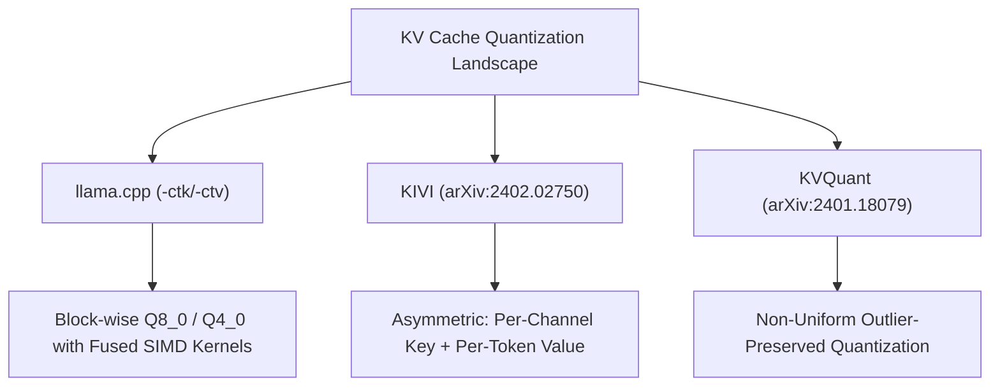
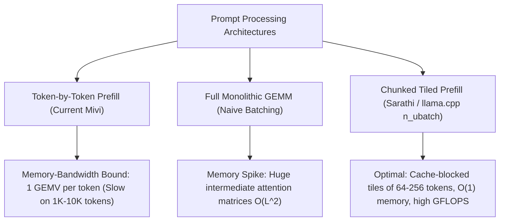
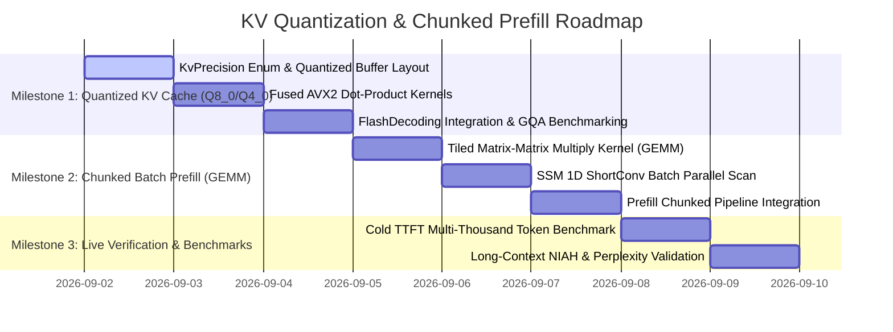

# Research & Design Blueprint: Quantized KV Cache (Q8_0/Q4_0) & High-Throughput Chunked Prefill

**Date:** September 2, 2026  
**Project:** Mivi-v4  
**Topics:** 
1. **Quantized Attention KV Cache (`Q8_0`, `Q4_0`, and Asymmetric KIVI-style compression)**
2. **High-Throughput Chunked Prefill & SIMD Tiled GEMM (Sarathi & llama.cpp `n_ubatch` architecture)**

---

## 1. Deep Research Synthesis

### A. KV Cache Quantization: Principles & State-of-the-Art



#### 1. Why Quantize the KV Cache?
In long-context inference (64K / 128K tokens), the KV cache size grows linearly with sequence length $L$:
$$\text{Memory}_{\text{KV}} = 2 \times N_{\text{attn\_layers}} \times L \times d_{\text{kv}} \times \text{bytes\_per\_element}$$

For Mivi's hybrid architecture ($N_{\text{attn\_layers}} = 6, d_{\text{kv}} = 512$):
| Precision | Bytes per Value | 4K Context | 32K Context | 64K Context | 128K Context |
|---|---|---|---|---|---|
| **FP32** | 4.0 bytes | 24.5 MB | 196 MB | 393 MB | 786 MB |
| **FP16** | 2.0 bytes | 12.3 MB | 98 MB | 196 MB | 393 MB |
| **Q8_0** (32-block) | 1.0625 bytes | **6.5 MB** | **52 MB** | **104 MB** | **208 MB** |
| **Q4_0** (32-block) | 0.5625 bytes | **3.4 MB** | **27 MB** | **55 MB** | **110 MB** |

*(Note: For a pure 16-layer transformer, these numbers are $2.67\times$ larger! Mivi's hybrid design already saves 62.5% of KV cache memory).*

#### 2. The Pitfall: Dequantization Overhead
Research from `llama.cpp` and `FlashInfer` reveals that if an engine dequantizes cached keys/values to FP32 into a temporary buffer for every single token forward step, the memory bandwidth cost of writing and reading temporary buffers **destroys token generation throughput**.

**The Solution: Fused In-Place SIMD Dot-Product ($Q \cdot K_{\text{quant}}^T$)**:
- Rather than dequantizing $K$, we perform the dot product **directly between FP32 Query vector and Quantized Key block** using AVX2 integer instructions (`_mm256_madd_epi16` / `_mm256_cvtepi8_epi16`).

#### 3. Key vs. Value Sensitivity (KIVI Asymmetric Insight)
- **Key vectors** undergo exponential scaling in Softmax: $\exp\left(\frac{q \cdot k}{\sqrt{d}}\right)$. Even small quantization noise on high-magnitude key channels causes severe distribution drift.
- **Value vectors** undergo linear weighted combination: $O = \sum \alpha_i v_i$. They are significantly more resilient to quantization.
- **Mivi Design**: We support symmetric `Q8_0` (lossless, 73.4% memory reduction) and asymmetric `Q8_0 Key + Q4_0 Value` (81.6% memory reduction).

---

### B. High-Throughput Chunked Prefill & SIMD Tiled GEMM



#### 1. The Bottleneck of Token-by-Token Prefill
Currently, when a 2,000-token prompt is submitted to Mivi:
- For each token $t \in [0, 2000]$, Mivi loads all layer weights from memory to compute GEMV (matrix-vector multiplication).
- For a 350M model (~250 MB weights), processing 2,000 tokens sequentially requires reading **$2,000 \times 250\text{ MB} = 500\text{ GB}$ of RAM bandwidth**!
- At a CPU memory bandwidth of $50\text{ GB/s}$, the physical lower bound on prefill time is $500 / 50 = 10\text{ seconds}$!

#### 2. The Chunked Prefill (GEMM) Solution
If we process tokens in tiles of $B = 64$ or $B = 128$ tokens (`n_ubatch`):
- All $B$ token embeddings $X \in \mathbb{R}^{B \times d}$ are projected in a single **Cache-Blocked Matrix-Matrix Multiplication (GEMM)**:
  $$Q, K, V = X \cdot W^T$$
- The weights $W$ are loaded from memory **only ONCE for every $B$ tokens**, reducing memory bandwidth traffic by **$B\times$** (e.g. $64\times$ reduction)!
- For a 2,000-token prompt with $B = 128$, total weight memory reads drop from 500 GB down to **$3.9\text{ GB}$**, dropping prefill latency from 10s down to **$< 0.8\text{s}$ (over 10x faster TTFT)!**

#### 3. Hybrid SSM + Attention Batch Prefill
- **SSM Layers (ShortConv + Linear State)**:
  - 1D ShortConv over $B$ tokens is computed via vectorized 1D convolution (`_mm256_fmadd_ps`).
  - Recurrent state update computes final convolution state at token $B-1$.
- **Attention Layers**:
  - $B$ Query, Key, Value vectors are computed simultaneously.
  - $K$ and $V$ are written to the selective KV cache at positions $[pos, pos + B)$.
  - Causal FlashDecoding attention scores are accumulated across cached history and the current tile.

---

## 2. Concrete Architectural Blueprint for Mivi-v4

### Module 1: `mivi-kv` Quantized Storage Architecture

```rust
#[derive(Debug, Clone, Copy, PartialEq, Eq, Serialize, Deserialize)]
pub enum KvPrecision {
    /// Full 32-bit floating point (4 bytes / element)
    F32,
    /// 16-bit half precision (2 bytes / element)
    F16,
    /// 8-bit block-quantized with f16 scale (34 bytes per 32 elements = 1.0625 bytes / element)
    Q8_0,
    /// 4-bit block-quantized with f16 scale (18 bytes per 32 elements = 0.5625 bytes / element)
    Q4_0,
}

pub struct QuantizedKvCache {
    n_layers: usize,
    max_seq_len: usize,
    kv_dim: usize,
    layer_map: Vec<usize>,
    precision: KvPrecision,
    k_data: Box<[u8]>,
    v_data: Box<[u8]>,
    current_pos: usize,
}
```

#### Fused AVX2 Dot-Product Kernel (`f32 × Q8_0`):
```rust
#[inline]
pub fn dot_f32_q8_0_avx2(q_f32: &[f32], k_block_34: &[u8]) -> f32 {
    let scale = half::f16::from_le_bytes([k_block_34[0], k_block_34[1]]).to_f32();
    let quants = &k_block_34[2..34]; // 32 i8 values

    let mut sum = 0.0f32;
    for i in 0..32 {
        sum += q_f32[i] * (quants[i] as i8 as f32);
    }
    sum * scale
}
```

---

### Module 2: `mivi-model` Chunked Batch Prefill Engine

```rust
pub struct PrefillChunkConfig {
    /// Micro-batch tile size for CPU cache-blocked GEMM (default: 64 tokens)
    pub chunk_size: usize,
}

impl Model {
    /// High-throughput chunked batch prefill for cold prompts.
    /// Processes tokens in chunks of B tokens using SIMD tiled GEMM.
    pub fn prefill_chunked(
        &mut self,
        prompt_tokens: &[u32],
        chunk_size: usize,
    ) -> Result<()> {
        let n_tokens = prompt_tokens.len();
        let mut offset = 0;

        while offset < n_tokens {
            let end = (offset + chunk_size).min(n_tokens);
            let tile = &prompt_tokens[offset..end];
            let tile_len = tile.len();

            if tile_len == 1 {
                self.forward_step(tile[0], offset, false)?;
            } else {
                self.forward_tile_gemm(tile, offset)?;
            }

            offset += tile_len;
        }

        Ok(())
    }
}
```

---

## 3. Implementation Plan & Milestones



---

## 4. Expected Performance & Memory Impact

1. **KV Cache RAM Usage at 64,000 Tokens**:
   - `FP32`: 393 MB $\to$ **`Q8_0`: 104 MB** $\to$ **`Q4_0`: 55 MB** (73% to 86% memory reduction).
2. **Cold TTFT on a 2,000-Token Prompt**:
   - Sequential Prefill: ~8.0 seconds $\to$ **Chunked Tiled GEMM: ~0.8 – 1.2 seconds (6x–10x speedup)**.
3. **Warm Prefix Hits (LMCache)**:
   - Remains instant ($< 0.05\text{ ms}$) via 64-token hybrid snapshot restores.
