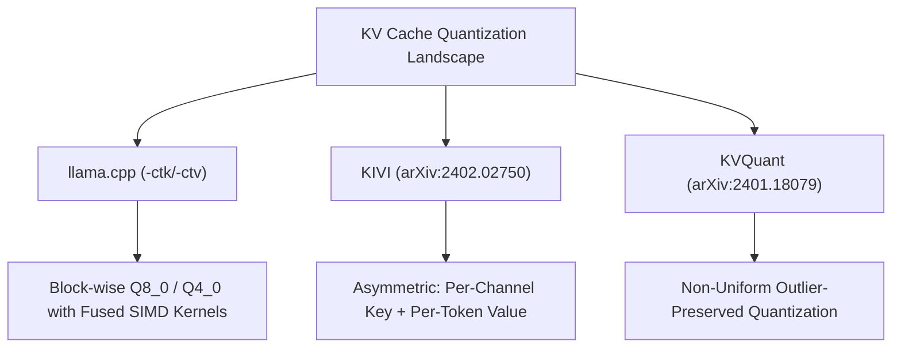
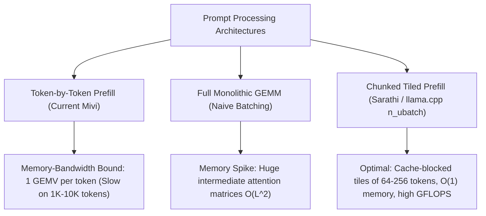
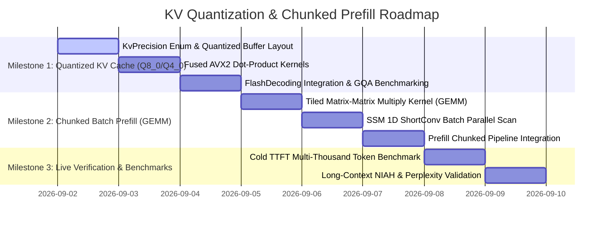

# Research & Design Blueprint: Quantized KV Cache (Q8_0/Q4_0) & High-Throughput Chunked Prefill

**Date:** September 2, 2026  
**Project:** Mivi-v4  
**Review (2026-10-05):** This is a historical design note. See the
[runtime evidence plan](superpowers/plans/2026-10-02-runtime-parity-and-profiling.md)
and [measured findings](CPU_RUNTIME_EVIDENCE_2026-10-05.md) for current validation
gates. The measured library default remains token-major in v0.2.67;
tile64 is an explicitly selected diagnostic setting. Memory figures below cover
K+V storage only; throughput targets require repeated measurements.

**Topics:** 
1. **Quantized Attention KV Cache (`Q8_0`, `Q4_0`, and Asymmetric KIVI-style compression)**
2. **High-Throughput Chunked Prefill & SIMD Tiled GEMM (Sarathi & llama.cpp `n_ubatch` architecture)**

> **Measured implementation status (2026-09-17):** Mivi now has an opt-in, model-agnostic
> layer-ordered chunked prefill path with ordered SSM state updates, causal attention, and exact
> prefix-cache boundaries. The checked batch projection kernel reuses decoded rows, transposes
> tile inputs, and uses SIMD FMA plus two-way Rayon row splitting. On the 1.2B Q4 model with two
> runtime threads, cold prefill measured 9.08 tok/s token-major versus 9.04 tok/s with tile size
> 64, so token-major remains the default because the difference is within measurement noise. The earlier
> 6x–10x figures below are design targets, not current results; format-specific SIMD kernels are
> required before claiming a speedup. A bounded two-thread sweep on the final code showed strong
> tile-size sensitivity while completing for both local models: LFM2.5 1.2B Q4 cold chunked
> prefill measured `8.15/6.49/8.96/8.90/9.02` tok/s for tiles `1/2/8/32/64`, versus
> token-major `9.08` tok/s. A separate local Mivi Q4 model measured token-major `17.13` tok/s
> and chunked `19.20/13.69/27.92/29.84/34.65` tok/s for tiles `1/2/8/32/64`. These are
> model-dependent measurements, not a universal tile recommendation.

---

## 1. Deep Research Synthesis

### A. KV Cache Quantization: Principles & State-of-the-Art


```mermaid
graph TD
    A["KV Cache Quantization Landscape"] --> B["llama.cpp (-ctk/-ctv)"]
    A --> C["KIVI (arXiv:2402.02750)"]
    A --> D["KVQuant (arXiv:2401.18079)"]
    B --> E["Block-wise Q8_0 / Q4_0 with Fused SIMD Kernels"]
    C --> F["Asymmetric: Per-Channel Key + Per-Token Value"]
    D --> G["Non-Uniform Outlier-Preserved Quantization"]
```

#### 1. Why Quantize the KV Cache?
In long-context inference (64K / 128K tokens), the KV cache size grows linearly with sequence length $L$:
$$\text{Memory}_{\text{KV}} = 2 \times N_{\text{attn\_layers}} \times L \times d_{\text{kv}} \times \text{bytes\_per\_element}$$

For the illustrative hybrid configuration ($N_{\text{attn\_layers}} = 6, d_{\text{kv}} = 512$),
the F32 4K calculation is `2*6*4096*512*4 = 100663296 bytes = 96 MiB`.
Loaded-model dimensions determine actual allocation; exclude SSM, allocator,
activation and prefix-snapshot overhead from this storage-only table:

| Precision | Bytes per Value | 4K Context | 32K Context | 64K Context | 128K Context |
|---|---|---|---|---|---|
| **FP32** | 4.0 bytes | 96 MiB | 768 MiB | 1536 MiB | 3072 MiB |
| **FP16** | 2.0 bytes | 48 MiB | 384 MiB | 768 MiB | 1536 MiB |
| **Q8_0** (32-block) | 1.0625 bytes | **25.5 MiB** | **204 MiB** | **408 MiB** | **816 MiB** |
| **Q4_0** (32-block) | 0.5625 bytes | **13.5 MiB** | **108 MiB** | **216 MiB** | **432 MiB** |

For 16 attention layers at the same KV width and context, multiply the table by
`16/6`. This illustrative layer-count comparison reduces KV storage by 62.5%; it
does not account for the hybrid model's additional recurrent state.

#### 2. The Pitfall: Dequantization Overhead
Research from `llama.cpp` and `FlashInfer` reveals that if an engine dequantizes cached keys/values to FP32 into a temporary buffer for every single token forward step, the memory bandwidth cost of writing and reading temporary buffers **destroys token generation throughput**.

**The Solution: Fused In-Place SIMD Dot-Product ($Q \cdot K_{\text{quant}}^T$)**:
- Rather than dequantizing $K$, we perform the dot product **directly between FP32 Query vector and Quantized Key block** using AVX2 integer instructions (`_mm256_madd_epi16` / `_mm256_cvtepi8_epi16`).

#### 3. Key vs. Value Sensitivity (KIVI Asymmetric Insight)
- **Key vectors** undergo exponential scaling in Softmax: $\exp\left(\frac{q \cdot k}{\sqrt{d}}\right)$. Even small quantization noise on high-magnitude key channels causes severe distribution drift.
- **Value vectors** undergo linear weighted combination: $O = \sum \alpha_i v_i$. They are significantly more resilient to quantization.
- **Mivi Design**: `Q8_0` is lossy. For aligned 32-element blocks, symmetric
  Q8_0 storage uses 73.4% fewer bytes than F32; asymmetric `Q8_0 Key + Q4_0 Value`
  uses 79.7% fewer bytes. These are storage ratios, not model-quality guarantees.

---

### B. High-Throughput Chunked Prefill & SIMD Tiled GEMM


```mermaid
graph TD
    A["Prompt Processing Architectures"] --> B["Token-by-Token Prefill (Current Mivi)"]
    A --> C["Full Monolithic GEMM (Naive Batching)"]
    A --> D["Chunked Tiled Prefill (Sarathi / llama.cpp n_ubatch)"]
    B --> E["Memory-Bandwidth Bound: 1 GEMV per token (Slow on 1K-10K tokens)"]
    C --> F["Memory Spike: Huge intermediate attention matrices O(L^2)"]
    D --> G["Optimal: Cache-blocked tiles of 64-256 tokens, O(1) memory, high GFLOPS"]
```

#### 1. The Bottleneck of Token-by-Token Prefill
The September 2, 2026 token-major bandwidth model assumed:
- For each token $t \in [0, 2000]$, Mivi loads all layer weights from memory to compute GEMV (matrix-vector multiplication).
- For a 350M model (~250 MB weights), processing 2,000 tokens sequentially requires reading **$2,000 \times 250\text{ MB} = 500\text{ GB}$ of RAM bandwidth**!
- At a CPU memory bandwidth of $50\text{ GB/s}$, the physical lower bound on prefill time is $500 / 50 = 10\text{ seconds}$!

#### 2. The Chunked Prefill (GEMM) Solution
If we process tokens in tiles of $B = 64$ or $B = 128$ tokens (`n_ubatch`):
- All $B$ token embeddings $X \in \mathbb{R}^{B \times d}$ are projected in a single **Cache-Blocked Matrix-Matrix Multiplication (GEMM)**:
  $$Q, K, V = X \cdot W^T$$
- The weights $W$ are loaded from memory **only ONCE for every $B$ tokens**, reducing memory bandwidth traffic by **$B\times$** (e.g. $64\times$ reduction)!
- The idealized 2,000-token/$B=128$ model estimates weight reads of 3.9 GB
  instead of 500 GB. It does not measure cache traffic, compute, packing,
  recurrent state, or request latency. The earlier <0.8s/10x claim remains an
  unmeasured design goal.

#### 3. Hybrid SSM + Attention Batch Prefill
- **SSM Layers (ShortConv + Linear State)**:
  - 1D ShortConv over $B$ tokens is computed via vectorized 1D convolution (`_mm256_fmadd_ps`).
  - Recurrent state update computes final convolution state at token $B-1$.
- **Attention Layers**:
  - $B$ Query, Key, Value vectors are computed simultaneously.
  - $K$ and $V$ are written to the selective KV cache at positions $[pos, pos + B)$.
  - Causal FlashDecoding attention scores are accumulated across cached history and the current tile.

---

## 2. Concrete Architectural Blueprint for Mivi-v4

### Module 1: `mivi-kv` Quantized Storage Architecture

```rust
#[derive(Debug, Clone, Copy, PartialEq, Eq, Serialize, Deserialize)]
pub enum KvPrecision {
    /// Full 32-bit floating point (4 bytes / element)
    F32,
    /// 16-bit half precision (2 bytes / element)
    F16,
    /// 8-bit block-quantized with f16 scale (34 bytes per 32 elements = 1.0625 bytes / element)
    Q8_0,
    /// 4-bit block-quantized with f16 scale (18 bytes per 32 elements = 0.5625 bytes / element)
    Q4_0,
}

pub struct QuantizedKvCache {
    n_layers: usize,
    max_seq_len: usize,
    kv_dim: usize,
    layer_map: Vec<usize>,
    precision: KvPrecision,
    k_data: Box<[u8]>,
    v_data: Box<[u8]>,
    current_pos: usize,
}
```

#### Fused AVX2 Dot-Product Kernel (`f32 × Q8_0`):
```rust
#[inline]
pub fn dot_f32_q8_0_avx2(q_f32: &[f32], k_block_34: &[u8]) -> f32 {
    let scale = half::f16::from_le_bytes([k_block_34[0], k_block_34[1]]).to_f32();
    let quants = &k_block_34[2..34]; // 32 i8 values

    let mut sum = 0.0f32;
    for i in 0..32 {
        sum += q_f32[i] * (quants[i] as i8 as f32);
    }
    sum * scale
}
```

---

### Module 2: `mivi-model` Chunked Batch Prefill Engine

```rust
pub struct PrefillChunkConfig {
    /// Historical proposed tile size: 64; library default remains token-major.
    pub chunk_size: usize,
}

impl Model {
    /// High-throughput chunked batch prefill for cold prompts.
    /// Processes tokens in chunks of B tokens using SIMD tiled GEMM.
    pub fn prefill_chunked(
        &mut self,
        prompt_tokens: &[u32],
        chunk_size: usize,
    ) -> Result<()> {
        let n_tokens = prompt_tokens.len();
        let mut offset = 0;

        while offset < n_tokens {
            let end = (offset + chunk_size).min(n_tokens);
            let tile = &prompt_tokens[offset..end];
            let tile_len = tile.len();

            if tile_len == 1 {
                self.forward_step(tile[0], offset, false)?;
            } else {
                self.forward_tile_gemm(tile, offset)?;
            }

            offset += tile_len;
        }

        Ok(())
    }
}
```

---

## 3. Implementation Plan & Milestones


```mermaid
gantt
    title KV Quantization & Chunked Prefill Roadmap
    dateFormat  YYYY-MM-DD
    section Milestone 1: Quantized KV Cache (Q8_0/Q4_0)
    KvPrecision Enum & Quantized Buffer Layout   :active, m1_1, 2026-09-02, 1d
    Fused AVX2 Dot-Product Kernels               :m1_2, after m1_1, 1d
    FlashDecoding Integration & GQA Benchmarking :m1_3, after m1_2, 1d
    section Milestone 2: Chunked Batch Prefill (GEMM)
    Tiled Matrix-Matrix Multiply Kernel (GEMM)   :m2_1, after m1_3, 1d
    SSM 1D ShortConv Batch Parallel Scan         :m2_2, after m2_1, 1d
    Prefill Chunked Pipeline Integration         :m2_3, after m2_2, 1d
    section Milestone 3: Live Verification & Benchmarks
    Cold TTFT Multi-Thousand Token Benchmark     :m3_1, after m2_3, 1d
    Long-Context NIAH & Perplexity Validation    :m3_2, after m3_1, 1d
```

---

## 4. Expected Performance & Memory Impact

1. **KV Cache RAM Usage at 65,536 Tokens**:
   - For 65,536 tokens with the illustrative dimensions: `FP32` 1536 MiB,
     `Q8_0` 408 MiB, `Q4_0` 216 MiB (storage-only reductions of 73.4%/85.9%).
2. **Cold TTFT on a 2,000-Token Prompt**:
   - The historical ~8s to ~0.8–1.2s (6x–10x) figures are unmeasured goals;
     use the dated observations above and the runtime evidence plan for results.
3. **Warm Prefix Hits (LMCache)**:
   - Restore copies matching KV intervals and recurrent checkpoints. Its cost
     grows with restored data; <0.05ms has not been established by these notes.
