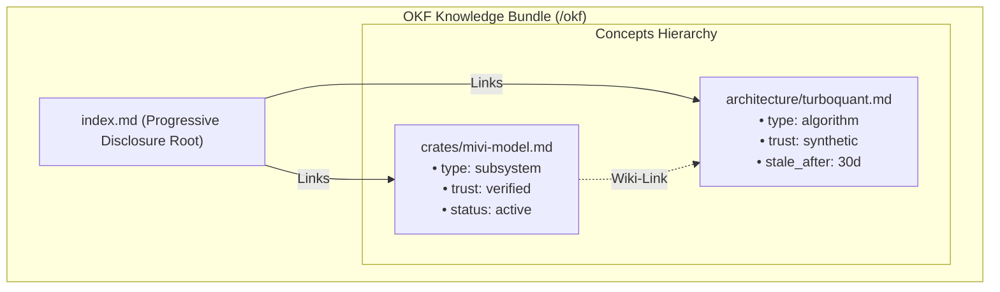
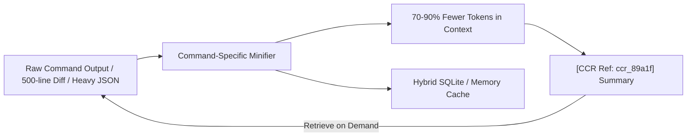

# Research & Architectural Analysis: OKF, DOX, and Headroom

**Date:** September 2, 2026  
**Sources:**
- **Open Knowledge Format (OKF v0.2)**: *Google Cloud Platform Open Knowledge Format Specification* ([github.com/GoogleCloudPlatform/open-knowledge-format](https://github.com/GoogleCloudPlatform/open-knowledge-format))
- **DOX**: *Hierarchical AGENTS.md Context Scoping* ([github.com/agent0ai/dox](https://github.com/agent0ai/dox))
- **Headroom MCP**: *High-Performance Context Compression Layer in Rust* ([github.com/aswin402/headroom-mcp](https://github.com/aswin402/headroom-mcp))

---

## 1. What is Open Knowledge Format (OKF v0.2)?

OKF is a universal, vendor-neutral specification created by Google Cloud Platform for representing agent knowledge, catalogs, and documentation as plain Markdown files with structured YAML frontmatter.

### Key Principles of OKF v0.2
- **Zero Tooling Requirement**: Pure Markdown + YAML frontmatter. If you can `cat` a file, you can read OKF; if you can `git clone`, you can distribute it.
- **First-Class Provenance & Trust**: Tracks where concepts originated (`sources`), who generated them (`generated: { by: "mivi", at: "..." }`), and who verified them (`verified: { by: "user", at: "..." }`).
- **Freshness & Lifecycle**: Includes `status: "active" | "stale" | "deprecated"` and `stale_after: "30d"`, enabling agents to purge or re-verify outdated knowledge.
- **Progressive Disclosure**: Hierarchical `index.md` files allow agents to navigate knowledge one directory at a time instead of blowing out the context window.

---

## 2. What is DOX?

DOX is an architectural pattern for autonomous agents that prevents context window bloating and instruction drift by using **hierarchical `AGENTS.md` scoping**:

- **Root `AGENTS.md`**: Project-wide guidelines, build commands, and global architecture.
- **Child `AGENTS.md`**: Local guidelines for specific subsystems (e.g. `crates/mivi-quant/AGENTS.md`).
- **Tree-Walk Scoping**: Before touching code, the agent walks the tree from the root to the target file, assembling only the relevant guidelines.
- **Continuous Maintenance**: After modifying code, the agent updates the corresponding child `AGENTS.md` to prevent doc drift.

---

## 3. What is Headroom MCP?

Headroom is a high-performance, native Rust context optimizer that keeps AI agent context clean and dense through **deterministic, reversible compression**:

### Key Innovations in Headroom
1. **Reversible Content Compression (CCR)**: Replaces massive JSON tables, compiler logs, and diffs with concise summaries and unique reference IDs (`[CCR Ref: ccr_...]`), storing the raw text in a sub-millisecond local cache for retrieval on demand.
2. **Command-Specific Minification**: Deep parsers for `cargo test`, `npm build`, `pytest`, and `git diff` that strip build spam and passing test lines while preserving error stack traces and failing assertions.
3. **Syntax-Aware Code Signature Extraction**: Replaces function and class bodies with `{ ... }` while retaining type definitions, structs, and interfaces.
4. **Tool Schema Minification (`compress_schema`)**: Strips redundant JSON Schema descriptions and whitespace to minimize prompt overhead.
5. **YAGNI Minimalism Enforcement**: Injects cognitive minimalism prompts to guide models to use native libraries and avoid over-engineering.

---

## 4. How Will These Help Supercharge Mivi-v4?

We have identified **3 transformative capabilities** for Mivi-v4:

---

### Area 1: Native Reversible Context Compression (CCR) & Tool Output Minification (`mivi-agent`) ✂️
- **The Problem**: Running `cargo test`, `git diff`, or querying large directory listings in the Agent loop dumps 2,000–10,000 tokens of raw terminal text into the KV cache, exhausting context and degrading speed.
- **The Solution in Mivi**:
  - Integrate a native Rust output minifier into `mivi-tools` and `mivi-agent`.
  - Automatically filter compiler progress bars and passing tests from `bash` execution output, reducing token consumption by up to **85%**.
  - Provide a `mivi_retrieve_original` tool for expanding compressed reference blocks on demand.

---

### Area 2: Hierarchical DOX Context Scoping (`mivi-context`) 📁
- **The Problem**: Injecting all project documentation and guidelines into every prompt wastes hundreds of tokens on unrelated crates.
- **The Solution in Mivi**:
  - Implement `mivi-context::dox::scope_hierarchy(target_path)` to dynamically discover and aggregate `AGENTS.md`, `CLAUDE.md`, and `onpkg.json` files from repo root to target directory.
  - Automatically injects precisely scoped instructions into the Agent loop.

---

### Area 3: OKF v0.2 Knowledge Bundle Engine & Memory Lifecycle (`mivi-memory`) 📚
- **The Solution in Mivi**:
  - Format all persistent agent memories in `.mivi/memories/` as valid OKF v0.2 bundles with `sources`, `trust_tier`, `stale_after`, and auto-generated `index.md` progressive disclosure indexes.
  - Allow exporting and importing knowledge bundles to and from Google Cloud Platform Knowledge Catalog or local Obsidian/MkDocs vaults.

---

## 5. Architectural Feature Comparison

| Capability | Standard LLM Engine | OKF | DOX | Headroom MCP | Proposed Mivi-v4 Engine |
|---|---|---|---|---|---|
| **Knowledge Representation** | Raw Text / Vectors | Markdown + YAML v0.2 | `AGENTS.md` | In-Memory / SQLite | **OKF v0.2 + 4-Bit TurboQuant** |
| **Context Scoping** | Flat System Prompt | Directory Tree | Hierarchical Walk | DOX Tree Scoper | **Automated DOX Hierarchical Scoping** |
| **Output Compression** | Truncation / Ellipsis | N/A | N/A | CCR + Minifiers | **Deterministic CCR + Command Minifiers** |
| **Trust & Provenance** | None | First-Class signals | None | Metadata tracking | **Trust Tiers + Credibility Scoring** |
