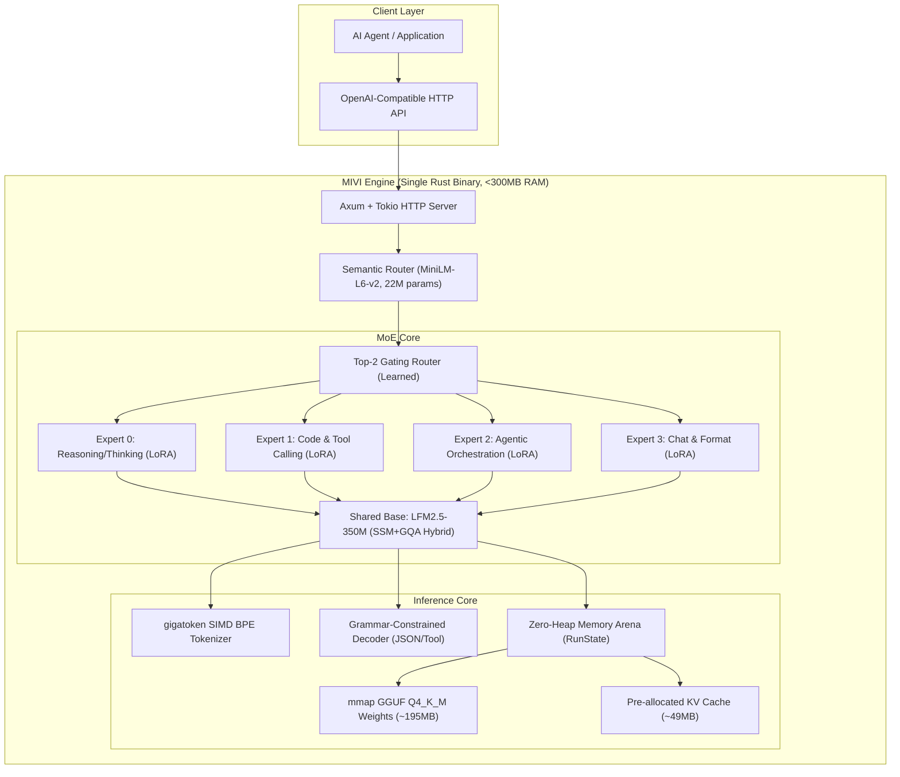

# MIVI v4 — Agentic SLM Engine

> A purpose-built Small Language Model + Mixture-of-Experts system with a Rust inference engine, designed to power AI agents on consumer hardware with <1GB RAM.

---

## 🎯 Project Vision

Build a **complete AI agent brain** that:
- Runs on any laptop without a GPU, under 1GB RAM
- Understands agent context, memory, tools, and skills natively
- Uses the internet for knowledge (like a real engineer) instead of memorizing facts
- Exposes a single-binary HTTP API that any agent framework can consume
- Thinks before acting, calls tools reliably, and routes between specialized experts

---

## 📐 Architecture Overview



---

## 🏗️ Key Architecture Decisions

### Decision 1: Base Model — **LiquidAI LFM2.5-350M**

| Criteria | LFM2.5-350M | Supra2-100M | GPT-X2.5-135M | Needle (45M) |
|---|---|---|---|---|
| **Architecture** | **Hybrid SSM+GQA** | Transformer | Transformer | Simple Attention |
| **Parameters** | **350M** | 100M | 135M | 45M |
| **Native Context** | **32K** | 2K | 8K | 256 |
| **Agentic Pre-training** | **✅ Tool calling, JSON** | ❌ Chat only | ❌ General | ⚠️ Micro tools |
| **Q4_K_M Size** | **~220MB** | ~60MB | ~85MB | ~14MB |
| **RAM @ 64K ctx** | **~500MB** | >1GB (quadratic) | >1GB (quadratic) | N/A |
| **KV Cache Scaling** | **Sub-quadratic (SSM)** | Quadratic | Quadratic | Sliding window |

> [!IMPORTANT]
> **LFM2.5-350M wins decisively** because its hybrid SSM+GQA architecture provides sub-quadratic memory scaling for long contexts — the *only* way to hit 64K context under 1GB RAM at 350M params. Pure transformers would blow the memory budget on KV cache alone.

### Decision 2: MoE Strategy — **Mixture of LoRA Experts (MoLE)**

Instead of duplicating the full model per expert (which would multiply RAM), we use **frozen base + switchable LoRA adapters**:

```
Frozen Base (LFM2.5-350M, Q4_K_M) ──── ~195MB (shared, loaded once)
  ├── LoRA Expert 0: Reasoning ────── ~8MB (rank-32, thinking/CoT)
  ├── LoRA Expert 1: Code+Tools ───── ~8MB (rank-32, JSON/function calling)
  ├── LoRA Expert 2: Agentic ──────── ~8MB (rank-32, routing/orchestration)
  └── LoRA Expert 3: Chat+Format ──── ~8MB (rank-32, conversation/formatting)
Router Gating Weights ─────────────── ~1MB
                                      ─────
Total Model Memory:                   ~228MB
```

The gating formula per layer:
$$h_{out} = W_0 x + \sum_{i \in \text{Top-2}} g_i(x) \cdot \frac{\alpha}{r} (B_i A_i x)$$

where $g(x) = \text{Softmax}(\text{Top-2}(W_g x))$

### Decision 3: Rust Engine — Zero-Heap Arena Architecture

Following `llama2.c` and `candle` patterns:

| Component | Memory | Strategy |
|---|---|---|
| Model weights (Q4_K_M) | ~195MB | `mmap` zero-copy from GGUF file |
| LoRA adapters (4×) | ~32MB | Loaded into pinned memory |
| KV cache (2K default) | ~49MB | Pre-allocated at startup |
| Activation scratchpad | ~8MB | Reused across all layers |
| Tokenizer (gigatoken) | ~4MB | Static lookup tables |
| HTTP server (axum+tokio) | ~20MB | Async runtime overhead |
| **Total** | **~308MB** | **Well under 1GB** |

### Decision 4: Context Strategy — Hybrid Internal + External

Inspired by `rlm` (recursive language model):

```
┌─────────────────────────────────────────┐
│ Internal Context Window: 2K-8K tokens   │ ◄── Fast, in KV cache
│ (Current turn, system prompt, tools)    │
├─────────────────────────────────────────┤
│ External Context: Unlimited             │ ◄── Tool-mediated retrieval
│ • Internet search (web_search tool)     │
│ • File reading (read_file tool)         │
│ • Database queries (sql tool)           │
│ • Vector search (semantic_search tool)  │
│ • Code execution (execute tool)         │
└─────────────────────────────────────────┘
```

> [!TIP]
> The model doesn't need 64K internal context for *everything*. Like a real engineer, it uses tools to fetch what it needs. The 32K native window handles complex multi-turn agent conversations, while knowledge retrieval happens through tool calls.

---

## 📊 Memory Budget Breakdown

```
┌──────────────────────────────────────────────────────────────┐
│                    1000 MB RAM Budget                         │
│                                                              │
│  ┌────────────────────────┐                                  │
│  │ Model Weights (Q4_K_M) │ 195 MB ██████████████████░░░░░░│
│  ├────────────────────────┤                                  │
│  │ LoRA Experts (4×r32)   │  32 MB ███░░░░░░░░░░░░░░░░░░░░│
│  ├────────────────────────┤                                  │
│  │ KV Cache (2K ctx)      │  49 MB █████░░░░░░░░░░░░░░░░░░│
│  ├────────────────────────┤                                  │
│  │ Scratchpad + Tokenizer │  12 MB █░░░░░░░░░░░░░░░░░░░░░░│
│  ├────────────────────────┤                                  │
│  │ HTTP Server + Runtime  │  20 MB ██░░░░░░░░░░░░░░░░░░░░░│
│  ├────────────────────────┤                                  │
│  │ Semantic Router (MiniLM)│  45 MB ████░░░░░░░░░░░░░░░░░░│
│  ├────────────────────────┤                                  │
│  │ ═══ TOTAL ═══          │ 353 MB ██████████████████████░░│
│  ├────────────────────────┤                                  │
│  │ ~~~ HEADROOM ~~~       │ 647 MB (available for extended │
│  │                        │         context / batching)     │
│  └────────────────────────┘                                  │
└──────────────────────────────────────────────────────────────┘
```

---

## 🗺️ Implementation Roadmap

### Phase 1: Rust Engine Core (Weeks 1-3)
> Build the inference engine that can load and run a GGUF model

| Task | Description | Priority |
|---|---|---|
| 1.1 | Project scaffolding: Cargo workspace with crates | P0 |
| 1.2 | GGUF file parser (read model metadata + tensor offsets) | P0 |
| 1.3 | Memory-mapped weight loading (`mmap`) | P0 |
| 1.4 | Q4_K_M dequantization kernels (SIMD: AVX2 + NEON) | P0 |
| 1.5 | Pre-allocated RunState arena (zero-heap inference) | P0 |
| 1.6 | Transformer forward pass: RMSNorm → QKV → GQA → SwiGLU FFN | P0 |
| 1.7 | SSM/Conv blocks for LFM hybrid layers | P0 |
| 1.8 | RoPE positional encoding with base frequency scaling | P0 |
| 1.9 | BPE tokenizer (integrate gigatoken or rustbpe) | P0 |
| 1.10 | Sampling: Temperature, Top-P, Top-K, repetition penalty | P1 |
| 1.11 | KV cache management (pre-allocated, sliding window) | P0 |

**Deliverable:** `mivi-engine` binary that loads a GGUF and generates text from CLI.

### Phase 2: HTTP API Server (Week 4)
> Wrap the engine in an OpenAI-compatible streaming API

| Task | Description | Priority |
|---|---|---|
| 2.1 | Axum HTTP server with `/v1/chat/completions` endpoint | P0 |
| 2.2 | SSE streaming response (token-by-token) | P0 |
| 2.3 | Tool/function calling schema in request/response | P0 |
| 2.4 | Grammar-constrained decoding for JSON tool output | P0 |
| 2.5 | `<think>` block detection and streaming control | P1 |
| 2.6 | `/v1/models` listing endpoint | P2 |
| 2.7 | Request queuing with bounded mpsc channels | P1 |
| 2.8 | Health check and metrics endpoints | P2 |

**Deliverable:** `mivi serve --model path/to/model.gguf --port 8080`

### Phase 3: Base Model Fine-Tuning (Weeks 5-7)
> Fine-tune LFM2.5-350M for agentic capabilities

| Task | Description | Priority |
|---|---|---|
| 3.1 | Dataset: Curate agentic tool-calling trajectories | P0 |
| 3.2 | Dataset: Curate `<think>` reasoning traces (distilled from R1) | P0 |
| 3.3 | Dataset: Curate multi-turn agent conversations | P0 |
| 3.4 | Dataset: Curate error-recovery & backtracking examples | P1 |
| 3.5 | Training: SFT cold start on combined dataset | P0 |
| 3.6 | Training: GRPO reinforcement learning with verifier rewards | P1 |
| 3.7 | Evaluation: Tool calling accuracy (BFCL benchmark) | P0 |
| 3.8 | Evaluation: Reasoning quality (GSM8K, ARC) | P1 |
| 3.9 | Export: Convert to GGUF Q4_K_M format | P0 |

**Deliverable:** `mivi-base-350m-agentic.gguf` fine-tuned checkpoint.

### Phase 4: LoRA Expert Training (Weeks 8-10)
> Train specialized LoRA adapters for each expert domain

| Expert | Training Focus | Dataset Sources |
|---|---|---|
| **Expert 0: Reasoning** | Chain-of-thought, `<think>` blocks, step-by-step math/logic | DeepSeek-R1 distillation, GSM8K CoT, MATH |
| **Expert 1: Code+Tools** | JSON function calling, code generation, structured output | ToolBench, BFCL, HumanEval, code-alpaca |
| **Expert 2: Agentic** | Multi-step planning, routing decisions, memory management | SWE-bench traces, agent trajectory distillation |
| **Expert 3: Chat** | Conversation, formatting, summarization, natural language | ShareGPT, UltraChat, instruction-following |

| Task | Description | Priority |
|---|---|---|
| 4.1 | LoRA training pipeline (rank-32, α=64) for each expert | P0 |
| 4.2 | Router gating weight training on mixed balanced dataset | P0 |
| 4.3 | Load-balancing auxiliary loss implementation | P0 |
| 4.4 | LoRA adapter → GGUF export pipeline | P0 |
| 4.5 | A/B evaluation: MoE vs single fine-tune | P1 |

**Deliverable:** 4 LoRA GGUF adapters + router weights.

### Phase 5: MoE Integration in Rust Engine (Weeks 11-12)
> Add LoRA hot-switching and gating to the inference loop

| Task | Description | Priority |
|---|---|---|
| 5.1 | LoRA adapter loading (multiple GGUF adapters) | P0 |
| 5.2 | Per-layer Top-2 gating computation | P0 |
| 5.3 | Fused LoRA forward: base + weighted expert contributions | P0 |
| 5.4 | Semantic router integration (MiniLM-L6-v2 embedding) | P1 |
| 5.5 | Dynamic expert selection based on system prompt/tools | P1 |
| 5.6 | Benchmarking: latency, throughput, memory validation | P0 |

**Deliverable:** Complete MoE inference in the Rust engine.

### Phase 6: Production Hardening (Weeks 13-14)
> Polish, optimize, and ship

| Task | Description | Priority |
|---|---|---|
| 6.1 | CI/CD: Cross-compilation (x86_64, aarch64, WASM) | P1 |
| 6.2 | TurboQuant KV cache compression (4-bit VQ) | P2 |
| 6.3 | Speculative decoding with DSpark draft model | P2 |
| 6.4 | Docker single-container deployment | P1 |
| 6.5 | Integration tests with popular agent frameworks | P0 |
| 6.6 | Documentation and CLI help | P1 |
| 6.7 | Benchmarks vs llama.cpp, ollama, candle | P1 |

**Deliverable:** Production-ready `mivi` binary.

---

## 🛠️ Technical Stack

### Rust Crates

| Crate | Purpose |
|---|---|
| `axum` | HTTP server framework |
| `tokio` | Async runtime |
| `serde` / `serde_json` | JSON serialization |
| `memmap2` | Memory-mapped file access |
| `half` | f16/bf16 types |
| `rayon` | CPU parallelism |
| `gigatoken` / custom | SIMD BPE tokenizer |
| `clap` | CLI argument parsing |
| `tracing` | Observability |

### Training Stack (Python, temporary)

| Tool | Purpose |
|---|---|
| `transformers` | Model loading & tokenizer |
| `peft` | LoRA adapter training |
| `trl` | GRPO reinforcement learning |
| `datasets` | Data loading |
| `llama.cpp` | GGUF conversion |

### Cargo Workspace Structure

```
mivi_v4/
├── Cargo.toml                    # Workspace root
├── crates/
│   ├── mivi-core/                # Tensor ops, quantization, SIMD kernels
│   │   ├── src/
│   │   │   ├── lib.rs
│   │   │   ├── tensor.rs         # Tensor storage & ops
│   │   │   ├── quantize.rs       # Q4_K_M, Q8_0 dequantization
│   │   │   ├── simd.rs           # AVX2/NEON dispatch
│   │   │   └── arena.rs          # Pre-allocated memory arena
│   │   └── Cargo.toml
│   ├── mivi-model/               # Model architecture & forward pass
│   │   ├── src/
│   │   │   ├── lib.rs
│   │   │   ├── gguf.rs           # GGUF file parser
│   │   │   ├── transformer.rs    # Attention, FFN, norms
│   │   │   ├── ssm.rs            # State-space model blocks (LFM hybrid)
│   │   │   ├── rope.rs           # Rotary position encoding
│   │   │   ├── kv_cache.rs       # KV cache management
│   │   │   ├── lora.rs           # LoRA adapter loading & forward
│   │   │   ├── moe.rs            # Top-K gating & expert routing
│   │   │   └── sampler.rs        # Temperature, Top-P, Top-K sampling
│   │   └── Cargo.toml
│   ├── mivi-tokenizer/           # BPE tokenizer (SIMD-accelerated)
│   │   ├── src/
│   │   │   ├── lib.rs
│   │   │   ├── bpe.rs            # Byte-pair encoding
│   │   │   └── vocab.rs          # Vocabulary loading
│   │   └── Cargo.toml
│   ├── mivi-server/              # HTTP API server
│   │   ├── src/
│   │   │   ├── lib.rs
│   │   │   ├── api.rs            # OpenAI-compatible endpoints
│   │   │   ├── streaming.rs      # SSE token streaming
│   │   │   ├── tool_call.rs      # Tool call detection & grammar
│   │   │   └── types.rs          # Request/response types
│   │   └── Cargo.toml
│   └── mivi-router/              # Semantic routing (MiniLM)
│       ├── src/
│       │   ├── lib.rs
│       │   └── embeddings.rs     # MiniLM-L6-v2 inference
│       └── Cargo.toml
├── src/
│   └── main.rs                   # CLI entry point (clap)
├── training/                     # Python training scripts
│   ├── datasets/                 # Dataset preparation
│   ├── sft/                      # Supervised fine-tuning
│   ├── grpo/                     # GRPO reinforcement learning
│   ├── lora/                     # LoRA expert training
│   ├── export/                   # GGUF conversion scripts
│   └── eval/                     # Evaluation benchmarks
├── models/                       # Model checkpoints (gitignored)
├── docs/                         # Documentation
└── tests/                        # Integration tests
```

---

## 🔧 Tool Calling Format

The model uses structured XML tags for reliable tool invocation:

```xml
<|im_start|>system
You are MIVI, an agentic AI assistant. You have access to tools.
<tools>
[{"name": "web_search", "parameters": {"query": {"type": "string"}}}]
</tools>
To use a tool, output: <tool_call>{"name": "...", "arguments": {...}}</tool_call>
Think inside <think>...</think> before acting.
<|im_end|>

<|im_start|>user
What's the latest Rust version?<|im_end|>

<|im_start|>assistant
<think>
I need to search the web for the current Rust version since my training
data may be outdated. I'll use the web_search tool.
</think>
<tool_call>{"name": "web_search", "arguments": {"query": "latest Rust programming language version 2026"}}</tool_call>
<|im_end|>

<|im_start|>tool
{"results": [{"title": "Rust 1.84.0", "snippet": "Released August 2026..."}]}
<|im_end|>

<|im_start|>assistant
The latest stable Rust version is **1.84.0**, released in August 2026.
<|im_end|>
```

---

## 📈 Performance Targets

| Metric | Target | Notes |
|---|---|---|
| **Peak RAM** | < 400MB | Q4_K_M weights + KV cache + runtime |
| **Max RAM** | < 1000MB | With extended context + semantic router |
| **Cold start** | < 2 seconds | mmap model loading |
| **Tokens/sec (prefill)** | > 100 tok/s | CPU-only, modern laptop |
| **Tokens/sec (decode)** | > 15 tok/s | CPU-only, single thread |
| **Tool call accuracy** | > 90% | With grammar-constrained decoding |
| **Binary size** | < 20MB | Static Rust binary |
| **Startup command** | 1 command | `mivi serve --model ./model.gguf` |

---

## 🔬 Research References Used

### Base Models Evaluated
- [LiquidAI/LFM2.5-350M](https://huggingface.co/LiquidAI/LFM2.5-350M) — **Selected base** ✅
- [SupraLabs/Supra2-100M-Instruct](https://huggingface.co/SupraLabs/Supra2-100M-Instruct) — Too small context
- [AxiomicLabs/GPT-X2.5-135M](https://huggingface.co/AxiomicLabs/GPT-X2.5-135M) — Good router candidate
- [Cactus-Compute/needle](https://huggingface.co/Cactus-Compute/needle) — Micro tool executor reference
- [sentence-transformers/all-MiniLM-L6-v2](https://huggingface.co/sentence-transformers/all-MiniLM-L6-v2) — Semantic router ✅

### Architecture Inspiration
- [karpathy/llama2.c](https://github.com/karpathy/llama2.c) — Zero-heap arena pattern
- [karpathy/llm.c](https://github.com/karpathy/llm.c) — Single-arena memory model
- [huggingface/candle](https://github.com/huggingface/candle) — Rust ML framework patterns
- [JustVugg/colibri](https://github.com/JustVugg/colibri) — MoE disk streaming
- [alexzhang13/rlm](https://github.com/alexzhang13/rlm) — Context externalization
- [karpathy/rustbpe](https://github.com/karpathy/rustbpe) — Rust tokenizer
- [marcelroed/gigatoken](https://github.com/marcelroed/gigatoken) — SIMD tokenizer

### Training & Agentic Patterns
- [NVlabs/ToolOrchestra](https://github.com/NVlabs/ToolOrchestra) — GRPO for orchestration
- [nvidia/Nemotron-Orchestrator-8B](https://huggingface.co/nvidia/Nemotron-Orchestrator-8B) — Orchestrator training
- [ShaoShuai0605/Harness-R1](https://huggingface.co/ShaoShuai0605/Harness-R1) — Execution-grounded reasoning
- [bottlecapai/ThinkingCap-Qwen3.6-27B](https://huggingface.co/bottlecapai/ThinkingCap-Qwen3.6-27B) — Token-efficient thinking
- [tonbistudio/turboquant-pytorch](https://github.com/tonbistudio/turboquant-pytorch) — KV cache compression

---

## ✅ Next Steps

1. **Scaffold the Rust workspace** — Create the Cargo workspace with all crates
2. **Implement GGUF parser** — Start with loading LFM2.5-350M
3. **Build forward pass** — Get basic text generation working
4. **Add HTTP API** — Wrap in axum server
5. **Begin dataset curation** — Prepare agentic training data in parallel
