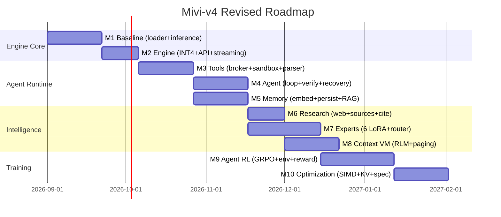

# Mivi-v4 — Revised Architecture (Post-Research)

> This document captures the architectural changes driven by the deep research phase.
> It supersedes conflicting decisions in the original PROJECT_PLAN.md and SPEC.md.

---

## Key Changes from Original Plan

| Decision | Original Plan | Revised (Post-Research) |
|---|---|---|
| **Expert count** | 4 LoRA experts | 6 initial, 10+ later |
| **Expert strategy** | Fixed top-2 per layer | Capability composition (multi-adapter) |
| **Routing** | Single-level gating | Two-level: task family → specialization |
| **Reasoning** | `<think>` verbose CoT | Compact structured plans (INTENT→PLAN→ACTION→VERIFY→ANSWER) |
| **64K context** | Native KV cache extension | 32K native + 64K runtime (Context VM + RLM) |
| **Context system** | Simple sliding window | Mivi Context VM with typed operations |
| **Companion model** | None | Mivi-Nano (20-60M) for routing/filtering |
| **Training base** | LFM2.5-350M (instruct) | LFM2.5-350M-**Base** (pre-instruct) |
| **Training stages** | 3 stages (SFT→GRPO→LoRA) | 10 progressive stages |
| **Failure training** | Not explicit | First-class failure corpus |
| **Tool loading** | All tools in every prompt | Dynamic tool discovery (5-12 relevant) |
| **Tool execution** | Model-adjacent | Sandboxed broker (model never executes directly) |
| **Knowledge format** | Not specified | OKF-inspired .mivi/ directory |
| **Dev methodology** | Rust-only | Reference (Python) + Production (Rust) |
| **Primary metric** | tok/s, memory | Agent intelligence per MB |
| **Crate structure** | 5 crates | 12 crates (more modular) |

---

## Revised Crate Structure

```
mivi_v4/
├── Cargo.toml                     # [workspace]
├── src/main.rs                    # CLI: serve, chat, info, bench, doctor
│
├── crates/
│   ├── mivi-core/                 # Tensor ops, SIMD, arena, math
│   ├── mivi-model/                # GGUF, transformer, SSM, forward pass
│   ├── mivi-tokenizer/            # BPE, vocab, special tokens
│   ├── mivi-quant/                # Quantization backends (INT4/INT8/FP16)
│   ├── mivi-kv/                   # KV cache (pluggable: FP16/INT8/FP8)
│   ├── mivi-context/              # Context VM, paging, RLM operations
│   ├── mivi-memory/               # Persistent memory, OKF format
│   ├── mivi-tools/                # Tool registry, broker, sandbox
│   ├── mivi-router/               # Two-level routing, expert selection
│   ├── mivi-agent/                # Agent loop, state machine, verification
│   ├── mivi-server/               # HTTP API, SSE, OpenAI compat
│   └── mivi-cli/                  # CLI commands, diagnostics
│
├── training/                      # Python training pipeline
│   ├── stage_0_baseline/          # Frozen baseline benchmark
│   ├── stage_1_instruction/       # English + instruction
│   ├── stage_2_agent/             # Agent state machine
│   ├── stage_3_tools/             # Tool calling (incl. failures)
│   ├── stage_4_planning/          # Task decomposition
│   ├── stage_5_coding/            # Code understanding
│   ├── stage_6_reasoning/         # Compact reasoning
│   ├── stage_7_experts/           # LoRA adapter training
│   ├── stage_8_router/            # Router training
│   ├── stage_9_preference/        # DPO
│   ├── stage_10_rl/               # GRPO agent RL
│   ├── datasets/                  # Data preparation
│   ├── export/                    # GGUF conversion
│   └── eval/                      # Evaluation scripts
│
├── reference/                     # Python reference implementation
│   └── reference_engine.py        # PyTorch oracle for correctness
│
├── evals/                         # Mivi Agent Benchmark (MAB)
│   ├── mab_chat/
│   ├── mab_tools/
│   ├── mab_agent/
│   ├── mab_code/
│   ├── mab_debug/
│   ├── mab_test/
│   ├── mab_research/
│   ├── mab_memory/
│   ├── mab_long_context/
│   └── mab_recovery/
│
├── skills/                        # Dynamic skill packs
│   ├── coding/
│   ├── debugging/
│   ├── research/
│   ├── testing/
│   └── frontend/
│
├── models/                        # Model files (gitignored)
├── tests/                         # Integration tests
├── benches/                       # Benchmarks
└── docs/                          # Documentation
```

---

## Revised Expert Architecture

### Initial experts (6)

| Expert | Capability Focus | Training Data |
|---|---|---|
| GENERAL | Instruction following, conversation, format | ShareGPT, UltraChat, formatting |
| AGENT | Planning, decomposition, state tracking, orchestration | Agent trajectories, multi-step tasks |
| CODE | Implementation, code understanding, repository work | Code-Alpaca, HumanEval, BFCL |
| DEBUG | Root-cause analysis, error interpretation, testing | Bug-fix pairs, test failures, error recovery |
| RESEARCH | Search orchestration, source evaluation, citation | Research trajectories, web search tasks |
| CHAT | Conversational quality, conciseness, empathy | High-quality conversations, distilled data |

### Adapter composition examples

```
"Fix my React API call and run tests"
→ AGENT + CODE + DEBUG

"Research the latest Rust release"
→ AGENT + RESEARCH

"Write a REST API for users"
→ AGENT + CODE + GENERAL

"Why is my CSS broken?"
→ CODE + DEBUG
```

---

## Revised Context Architecture

### Context Store (replaces simple sliding window)

```
ContextStore
│
├── block 0: system prompt          (pinned)
├── block 1: active tool schemas    (pinned)
├── block 2: task memory            (ranked)
├── block 3: retrieved knowledge    (ranked)
├── block 4: conversation recent    (FIFO)
├── block 5: working context        (growing)
└── block N: ...

Each block:
  tokens, source, timestamp, importance, embedding, pinned?
```

### Example active context (of 64K available)

```
system        1K
task          2K
memory        2K
retrieved     4K
tools         1K
working       4K
────────────────
active       14K  (model sees this)
stored       50K  (context VM can access)
```

---

## Revised Training Data Architecture

### Six major data classes

```
D1: general instruction        — 15%
D2: agent trajectories         — 25%
D3: tool trajectories          — 20%
D4: coding trajectories        — 15%
D5: research trajectories      — 10%
D6: reasoning/verification     — 10%
D7: failure/recovery           —  5%  ← NEW
```

### Failure Corpus (new, critical)

```
tool timeout → detect → recover
bad arguments → repair → retry
wrong file → inspect → correct
search result poor → reformulate query
conflicting sources → evaluate → choose
test failure → diagnose → patch → retest
context insufficient → retrieve more
wrong expert → reassess → re-route
```

---

## Revised API Endpoints

### Standard OpenAI-compatible

```
GET  /v1/models
POST /v1/chat/completions
POST /v1/completions
```

### Mivi extensions

```
POST /v1/mivi/agent        — full agent loop execution
POST /v1/mivi/memory       — memory operations
GET  /v1/mivi/tools        — list available tools
GET  /v1/mivi/status       — engine status + metrics
GET  /health               — health check
GET  /metrics              — prometheus-style metrics
```

---

## Revised Memory Budget

```
Component                       Target Range       Notes
──────────────────────────────  ────────────       ─────
INT4 model weights              180–250 MB         mmap demand-paged
Runtime / buffers                50–120 MB         RunState arena
KV cache                         50–200 MB         Depends on active context
Tokenizer                        10–30 MB          BPE + special tokens
Expert adapters (6×)              10–80 MB          LoRA, most resident
Mivi-Nano (future)               20–60 MB          Optional companion
Server / agent runtime           40–120 MB         axum + tokio + tools
──────────────────────────────  ────────────
Normal total                    340–800 MB
Target peak RSS                 < 900 MB
```

---

## Revised Milestone Roadmap



---

## Key Principles (Locked)

1. **Model = reasoning/control. Runtime = execution/capabilities.**
2. **Agent intelligence per MB** is the primary metric, not generic benchmarks.
3. **Train in the deployment environment** (Agent Harness).
4. **Failure trajectories are first-class training data.**
5. **Task-preserving compression** — evaluate quantization against task success, not proxy metrics.
6. **Two engines during development** — Python reference + Rust production.
7. **Dynamic tool discovery** — don't waste context on irrelevant tool schemas.
8. **The model should never directly execute privileged operations** — the broker decides.
9. **Start from Base, not Instruct** — we define the behavior distribution.
10. **Six strong experts are better than twenty weak ones.**
