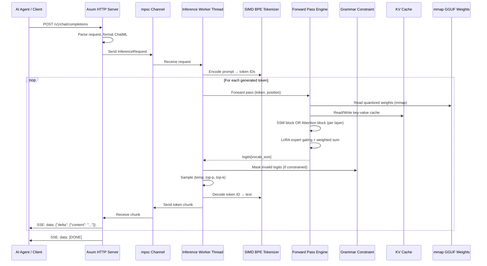
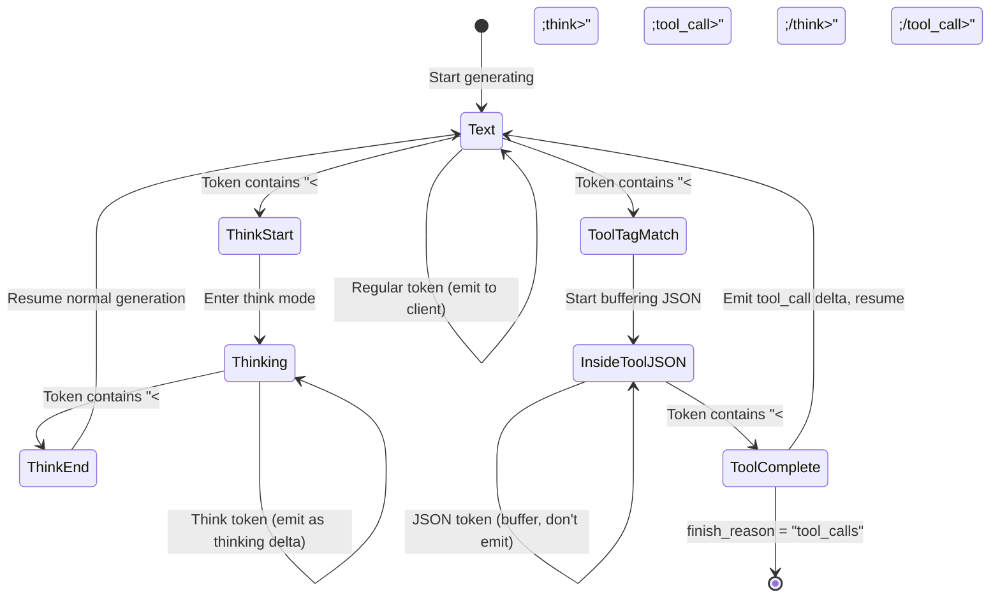

# mivi-v4 — Technical Specification

**Version:** 1.0  
**Date:** 2026-08-28  
**Status:** Draft  

---

## 1. System Architecture

### 1.1 High-Level Data Flow



### 1.2 Process Architecture

```
┌─────────────────────────────────────────────────────────────────┐
│                    mivi Process (Single Binary)                  │
│                                                                  │
│  ┌──────────────────────────────────────────────────────────┐   │
│  │ Tokio Runtime (async, multi-threaded)                     │   │
│  │  ┌────────────┐  ┌────────────┐  ┌────────────────────┐  │   │
│  │  │ HTTP/SSE   │  │ Request    │  │ Health/Metrics     │  │   │
│  │  │ Handler    │  │ Queue      │  │ Endpoints          │  │   │
│  │  │ (async)    │  │ (mpsc)     │  │ (async)            │  │   │
│  │  └─────┬──────┘  └─────┬──────┘  └────────────────────┘  │   │
│  └────────┼───────────────┼──────────────────────────────────┘   │
│           │               │                                       │
│  ┌────────▼───────────────▼──────────────────────────────────┐   │
│  │ Inference Worker (dedicated CPU thread, pinned)            │   │
│  │  ┌──────────┐ ┌──────────┐ ┌──────────┐ ┌──────────────┐ │   │
│  │  │Tokenizer │ │ Forward  │ │ Grammar  │ │ Tool Call    │ │   │
│  │  │(gigatoken│ │ Pass     │ │ DFA      │ │ Detector     │ │   │
│  │  │ SIMD)    │ │ Engine   │ │          │ │ (State Mach) │ │   │
│  │  └──────────┘ └──────────┘ └──────────┘ └──────────────┘ │   │
│  │                                                            │   │
│  │  ┌─────────────────────── Memory Arena ──────────────────┐ │   │
│  │  │ RunState (~8MB)  │ KV Cache (~49MB)  │ LoRAs (~32MB) │ │   │
│  │  └──────────────────┴──────────────────┴─────────────────┘ │   │
│  └────────────────────────────────────────────────────────────┘   │
│                                                                    │
│  ┌────────────────── mmap Region (OS Managed) ──────────────────┐ │
│  │ GGUF Model Weights (Q4_K_M) — ~195MB virtual, demand-paged  │ │
│  └──────────────────────────────────────────────────────────────┘ │
└──────────────────────────────────────────────────────────────────┘
```

---

## 2. GGUF File Format

### 2.1 File Layout

```
Offset    Content
──────    ─────────────────────────────────
0x0000    Magic: 0x46554747 ("GGUF" LE)
0x0004    Version: u32 (3)
0x0008    Tensor Count: u64
0x0010    Metadata KV Count: u64
0x0018    Metadata Key-Value Pairs [...]
          ├── "general.architecture": string = "lfm"
          ├── "general.name": string = "mivi-v4"
          ├── "lfm.context_length": u32 = 32768
          ├── "lfm.embedding_length": u32 = 1024
          ├── "lfm.block_count": u32 = 24
          ├── "lfm.attention.head_count": u32 = 16
          ├── "lfm.attention.head_count_kv": u32 = 4
          ├── "lfm.feed_forward_length": u32 = 2816
          ├── "lfm.rope.freq_base": f32 = 1000000.0
          ├── "tokenizer.ggml.model": string = "bpe"
          └── "tokenizer.ggml.tokens": string[] = [...]
????      Tensor Info Array [...]
          ├── TensorInfo { name, n_dims, dims[], type, offset }
          ├── TensorInfo { name, n_dims, dims[], type, offset }
          └── ...
ALIGNED   Tensor Data (aligned to 32 bytes)
          ├── "token_embd.weight": Q8_0 [65536, 1024]
          ├── "blk.0.attn_norm.weight": F32 [1024]
          ├── "blk.0.attn_q.weight": Q4_K_M [1024, 1024]
          ├── "blk.0.attn_k.weight": Q4_K_M [256, 1024]
          ├── "blk.0.attn_v.weight": Q4_K_M [256, 1024]
          ├── "blk.0.ssm_conv.weight": F32 [...]     ← SSM layers
          ├── "blk.0.ssm_state.weight": F32 [...]
          └── ...
```

### 2.2 Quantization Block Structures

#### Q4_K_M (4-bit K-Quant Medium) — Primary Format

```
Super-block: 256 elements
├── d: f16           (2 bytes)  — super-block scale
├── dmin: f16        (2 bytes)  — super-block minimum  
├── scales: [u8; 12] (12 bytes) — 8 sub-block scales (6-bit packed)
└── qs: [u8; 128]   (128 bytes) — 256 4-bit weights packed into 128 bytes
                     ─────────
Total: 144 bytes per 256 elements = 4.5 bits/weight
```

**Dequantization formula:**
```
For sub-block j (32 elements each, 8 sub-blocks per super-block):
  scale_j = decode_6bit(scales, j)
  for i in 0..32:
    weight[j*32 + i] = d * scale_j * (qs[nibble_index] - 8) - dmin * min_scale_j
```

#### Q8_0 (8-bit block quantization) — High quality

```
Block: 32 elements
├── d: f16        (2 bytes)  — block scale
└── qs: [i8; 32]  (32 bytes) — 32 signed 8-bit weights
                   ─────────
Total: 34 bytes per 32 elements = 8.5 bits/weight
```

---

## 3. Memory Layout

### 3.1 RunState Arena (Pre-allocated at startup)

```rust
/// All inference buffers. Allocated once, reused every token.
/// Zero heap allocations during the decode loop.
pub struct RunState {
    // --- Per-token activations (reused each step) ---
    pub x: Box<[f32]>,          // [dim=1024]              4 KB
    pub xb: Box<[f32]>,         // [dim=1024]              4 KB
    pub xb2: Box<[f32]>,        // [dim=1024]              4 KB
    pub hb: Box<[f32]>,         // [hidden_dim=2816]      11 KB
    pub hb2: Box<[f32]>,        // [hidden_dim=2816]      11 KB
    pub q: Box<[f32]>,          // [dim=1024]              4 KB
    pub k: Box<[f32]>,          // [kv_dim=256]            1 KB
    pub v: Box<[f32]>,          // [kv_dim=256]            1 KB
    pub att: Box<[f32]>,        // [n_heads*seq_len]     128 KB (at 2K)
    pub logits: Box<[f32]>,     // [vocab_size=65536]    256 KB

    // --- SSM recurrent state (per SSM layer) ---
    pub ssm_state: Box<[f32]>,  // [n_ssm_layers * state_dim]

    // --- KV Cache (pre-allocated for max context) ---
    pub key_cache: Box<[f32]>,  // [n_attn_layers * seq_len * kv_dim]
    pub value_cache: Box<[f32]>,// [n_attn_layers * seq_len * kv_dim]

    // --- LoRA computation buffers ---
    pub lora_down: Box<[f32]>,  // [max_rank=64]         256 B
    pub lora_up: Box<[f32]>,    // [dim=1024]              4 KB
    pub gate_logits: Box<[f32]>,// [n_experts=4]          16 B
}
```

### 3.2 Total Memory Budget (Exact)

```
Component                          Formula                                    Bytes        MB
─────────────────────────────────  ─────────────────────────────────────────  ───────────  ────
Model weights (Q4_K_M)             350M × 4.5 bits / 8                       196,875,000   188
Embedding (Q8_0)                   65536 × 1024 × 8.5/8                       8,912,896     9
RunState activations               (see struct above)                            424,960   0.4
KV cache (FP16, 2K ctx)            2 × 12 × 2048 × 256 × 2                  25,165,824    24
    (only attention layers)
SSM hidden state                   12 × 5120 × 4                               245,760   0.2
LoRA adapters (4× rank-32)         4 × 2 × 32 × 1024 × 24_layers × 2       12,582,912    12
    (A: [r,d], B: [d,r] per layer, FP16)
Router gating weights              24_layers × 1024 × 4 × 4                     393,216   0.4
Tokenizer vocab                    65536 × avg_16_bytes + merges              ~4,000,000     4
HTTP server + tokio runtime        (empirical)                               ~20,000,000    20
OS/libc overhead                   (empirical)                                ~5,000,000     5
─────────────────────────────────                                            ───────────  ────
TOTAL                                                                       ~274 MB       263
```

> [!NOTE]
> The 24 transformer blocks in LFM2.5-350M are split roughly 50/50 between SSM blocks (~12) and Attention blocks (~12). Only the attention blocks need KV cache, which halves the cache memory vs a pure transformer.

---

## 4. Inference Pipeline

### 4.1 Forward Pass (Single Token, Decode Phase)

```
Input: token_id (u32), position (usize)

┌─────────────────────────────────────────────────────┐
│ 1. EMBEDDING LOOKUP                                  │
│    x = embedding_table[token_id]  // Q8_0 → f32     │
│    x: [1024]                                         │
└─────────────────────┬───────────────────────────────┘
                      │
    ┌─────────────────▼─────────────────────────────────────┐
    │ FOR EACH BLOCK (0..23):                                │
    │                                                        │
    │   ┌────────────────────────────────────────────────┐   │
    │   │ 2. PRE-NORM: x_norm = rms_norm(x, weight)     │   │
    │   └─────────────────────┬──────────────────────────┘   │
    │                         │                              │
    │   IF block_type == SSM:                                │
    │   ┌─────────────────────▼──────────────────────────┐   │
    │   │ 3a. SSM BLOCK                                   │   │
    │   │   • Conv1D: x_conv = conv(x_norm, conv_weight) │   │
    │   │   • Gate: x_gate = silu(gate_proj(x_norm))     │   │
    │   │   • Recurrence: h = A*h + B*x_conv             │   │
    │   │   • Output: y = C*h                             │   │
    │   │   • Gated: y = y ⊙ x_gate                      │   │
    │   │   • Project: y = out_proj(y)                    │   │
    │   └─────────────────────┬──────────────────────────┘   │
    │                         │                              │
    │   IF block_type == ATTENTION:                          │
    │   ┌─────────────────────▼──────────────────────────┐   │
    │   │ 3b. GQA ATTENTION BLOCK                         │   │
    │   │   • Q = q_proj(x_norm)  → [n_heads, head_dim]  │   │
    │   │   • K = k_proj(x_norm)  → [n_kv, head_dim]     │   │
    │   │   • V = v_proj(x_norm)  → [n_kv, head_dim]     │   │
    │   │   • Apply RoPE to Q, K                          │   │
    │   │   • Store K, V in kv_cache[layer][position]     │   │
    │   │   • For each query head:                        │   │
    │   │     - att = Q_h · K_cache^T / √d_head           │   │
    │   │     - att = softmax(att)                        │   │
    │   │     - out_h = att · V_cache                     │   │
    │   │   • Concatenate heads, project: y = o_proj(out) │   │
    │   └─────────────────────┬──────────────────────────┘   │
    │                         │                              │
    │   ┌─────────────────────▼──────────────────────────┐   │
    │   │ 4. LoRA EXPERT ROUTING (per applicable layer)   │   │
    │   │   • gate = softmax(top_2(W_gate · x_norm))     │   │
    │   │   • For top-2 experts i:                        │   │
    │   │     lora_out += gate[i] * (α/r) * B_i(A_i(x))  │   │
    │   │   • y = y + lora_out                            │   │
    │   └─────────────────────┬──────────────────────────┘   │
    │                         │                              │
    │   ┌─────────────────────▼──────────────────────────┐   │
    │   │ 5. RESIDUAL: x = x + y                          │   │
    │   └─────────────────────┬──────────────────────────┘   │
    │                         │                              │
    │   ┌─────────────────────▼──────────────────────────┐   │
    │   │ 6. POST-NORM + FFN                              │   │
    │   │   • x_norm2 = rms_norm(x, weight2)              │   │
    │   │   • gate = silu(w_gate · x_norm2)               │   │
    │   │   • up = w_up · x_norm2                         │   │
    │   │   • ffn_out = w_down · (gate ⊙ up)  [SwiGLU]   │   │
    │   │   • x = x + ffn_out                             │   │
    │   └─────────────────────┬──────────────────────────┘   │
    │                         │                              │
    └─────────────────────────┼─────────────────────────────┘
                              │
┌─────────────────────────────▼───────────────────────────────┐
│ 7. FINAL NORM + LOGITS                                       │
│    x = rms_norm(x, final_norm_weight)                        │
│    logits = lm_head · x   // [vocab_size=65536]              │
└─────────────────────────────┬───────────────────────────────┘
                              │
┌─────────────────────────────▼───────────────────────────────┐
│ 8. GRAMMAR MASKING (if tool_call mode)                       │
│    for i in 0..vocab_size:                                   │
│      if !grammar_dfa.is_valid_transition(token_i):           │
│        logits[i] = -∞                                        │
└─────────────────────────────┬───────────────────────────────┘
                              │
┌─────────────────────────────▼───────────────────────────────┐
│ 9. SAMPLING                                                  │
│    • Apply temperature: logits /= temperature                │
│    • Apply top-k: keep only top-k logits                     │
│    • Apply top-p (nucleus): keep cumulative prob ≤ p         │
│    • Apply min-p: discard tokens with prob < min_p × max     │
│    • Apply repetition penalty on recent tokens               │
│    • Softmax → probability distribution                      │
│    • Sample from distribution → next_token_id                │
└─────────────────────────────────────────────────────────────┘
```

### 4.2 RoPE (Rotary Position Encoding)

```rust
/// Apply rotary position encoding to query and key vectors.
/// Uses base frequency scaling for extended context.
fn apply_rope(q: &mut [f32], k: &mut [f32], head_dim: usize, pos: usize, rope_base: f32) {
    for i in (0..head_dim).step_by(2) {
        let freq = 1.0 / rope_base.powf(i as f32 / head_dim as f32);
        let angle = pos as f32 * freq;
        let (sin, cos) = angle.sin_cos();
        
        // Rotate query
        let q0 = q[i];
        let q1 = q[i + 1];
        q[i]     = q0 * cos - q1 * sin;
        q[i + 1] = q0 * sin + q1 * cos;
        
        // Rotate key
        let k0 = k[i];
        let k1 = k[i + 1];
        k[i]     = k0 * cos - k1 * sin;
        k[i + 1] = k0 * sin + k1 * cos;
    }
}
```

---

## 5. Tool Call Detection State Machine



### 5.1 Grammar DFA for Tool Call JSON

```
States:
  S0: Expect '{'
  S1: Expect '"name"'
  S2: Expect ':'
  S3: Expect string value (tool name)
  S4: Expect ',' or '}'
  S5: Expect '"arguments"'
  S6: Expect ':'
  S7: Inside arguments object (recursive JSON)
  S8: Expect '}' (closing)
  ACCEPT: Valid tool call

Transitions:
  S0 --'{'--> S1
  S1 --'"'--> S2 (reading "name" key)
  S2 --':'--> S3
  S3 --string--> S4
  S4 --','--> S5
  S4 --'}'--> ACCEPT (no arguments)
  S5 --'"'--> S6 (reading "arguments" key)
  S6 --':'--> S7
  S7 --valid_json--> S7 (recursive)
  S7 --'}'--> S8
  S8 --'}'--> ACCEPT
```

---

## 6. HTTP API Specification

### 6.1 Server Configuration

```rust
pub struct ServerConfig {
    pub host: String,           // default: "127.0.0.1"; public binds require MIVI_API_KEY
    pub port: u16,              // default: 8080
    pub cors_allowed_origins: Vec<String>, // default: empty; exact browser origins only
    pub model_path: Option<PathBuf>, // optional; inference is unavailable until a model is loaded
    pub lora_paths: Vec<PathBuf>, // optional
    pub max_context: usize,     // default: 2048
    pub n_threads: usize,       // default: num_cpus
    pub api_key: Option<String>,// optional auth
}
```

### 6.2 Endpoints

| Method | Path | Description |
|---|---|---|
| `POST` | `/v1/chat/completions` | Chat completion (streaming/non-streaming) |
| `POST` | `/v1/completions` | Raw text completion |
| `GET` | `/v1/models` | List loaded models |
| `GET` | `/health` | Health check |
| `GET` | `/metrics` | Inference metrics |

### 6.3 Chat Completion Request Schema

```rust
#[derive(Deserialize)]
pub struct ChatCompletionRequest {
    pub model: String,
    pub messages: Vec<Message>,
    #[serde(default)]
    pub tools: Option<Vec<Tool>>,
    #[serde(default = "default_auto")]
    pub tool_choice: ToolChoice,  // "auto" | "none" | {"type":"function","function":{"name":"..."}}
    #[serde(default = "default_temp")]
    pub temperature: f32,         // 0.0 - 2.0, default 0.7
    #[serde(default)]
    pub top_p: Option<f32>,       // 0.0 - 1.0
    #[serde(default)]
    pub top_k: Option<usize>,     // 1 - vocab_size
    #[serde(default)]
    pub min_p: Option<f32>,       // 0.0 - 1.0 (Mivi extension)
    #[serde(default)]
    pub max_tokens: Option<usize>,// max generation length
    #[serde(default)]
    pub stream: bool,             // SSE streaming
    #[serde(default = "default_true")]
    pub thinking: bool,           // enable <think> blocks
    #[serde(default)]
    pub stop: Option<Vec<String>>,// custom stop sequences
    #[serde(default)]
    pub repetition_penalty: Option<f32>,
    #[serde(default)]
    pub presence_penalty: Option<f32>,
    #[serde(default)]
    pub frequency_penalty: Option<f32>,
    #[serde(default)]
    pub seed: Option<u64>,
    #[serde(default)]
    pub response_format: Option<ResponseFormat>,
}

#[derive(Deserialize)]
pub struct Message {
    pub role: Role,               // system | user | assistant | tool
    pub content: Option<String>,
    pub tool_calls: Option<Vec<ToolCall>>,
    pub tool_call_id: Option<String>,
}

#[derive(Deserialize)]
pub struct Tool {
    pub r#type: String,           // "function"
    pub function: FunctionDef,
}

#[derive(Deserialize)]
pub struct FunctionDef {
    pub name: String,
    pub description: Option<String>,
    pub parameters: serde_json::Value, // JSON Schema
}
```

The server currently accepts `tool_choice` values `auto`, `none`, and a named function. It rejects
`tool_choice: "required"`, JSON Schema response formats, and JSON streaming with an explicit invalid
request error. `response_format: {"type":"json_object"}` is supported for non-streaming requests.

### 6.4 Streaming Response Chunks

```rust
#[derive(Serialize)]
pub struct ChatCompletionChunk {
    pub id: String,
    pub object: &'static str,    // "chat.completion.chunk"
    pub created: u64,
    pub model: String,
    pub choices: Vec<ChunkChoice>,
}

#[derive(Serialize)]
pub struct ChunkChoice {
    pub index: usize,
    pub delta: Delta,
    pub finish_reason: Option<FinishReason>,
}

#[derive(Serialize)]
pub struct Delta {
    #[serde(skip_serializing_if = "Option::is_none")]
    pub role: Option<String>,
    #[serde(skip_serializing_if = "Option::is_none")]
    pub content: Option<String>,
    #[serde(skip_serializing_if = "Option::is_none")]
    pub thinking: Option<String>,    // mivi-v4 extension
    #[serde(skip_serializing_if = "Option::is_none")]
    pub tool_calls: Option<Vec<ToolCallDelta>>,
}
```

---

## 7. Cargo Workspace Structure

```
mivi_v4/
├── Cargo.toml                          # [workspace]
├── Cargo.lock
├── src/main.rs                         # CLI entry (clap): serve, chat, info, bench
│
├── crates/
│   ├── mivi-core/                      # Low-level tensor ops & memory
│   │   ├── Cargo.toml
│   │   └── src/
│   │       ├── lib.rs
│   │       ├── tensor.rs               # f32/f16 tensor storage & basic ops
│   │       ├── quantize.rs             # Q4_K_M, Q4_0, Q8_0 block types & dequant
│   │       ├── simd/
│   │       │   ├── mod.rs              # Dispatch: avx2 | neon | scalar fallback
│   │       │   ├── avx2.rs             # x86_64 SIMD matvec kernels
│   │       │   ├── neon.rs             # aarch64 SIMD matvec kernels
│   │       │   └── scalar.rs           # Portable fallback
│   │       ├── arena.rs                # RunState: pre-allocated inference buffers
│   │       └── math.rs                 # rms_norm, softmax, silu, rope
│   │
│   ├── mivi-model/                     # Model architecture & forward pass
│   │   ├── Cargo.toml
│   │   └── src/
│   │       ├── lib.rs
│   │       ├── gguf.rs                 # GGUF file parser (header, metadata, tensors)
│   │       ├── config.rs               # Model config from GGUF metadata
│   │       ├── transformer.rs          # GQA attention block forward pass
│   │       ├── ssm.rs                  # State-space model block forward pass
│   │       ├── ffn.rs                  # SwiGLU feed-forward network
│   │       ├── norm.rs                 # RMSNorm implementation
│   │       ├── rope.rs                 # RoPE with base frequency scaling
│   │       ├── kv_cache.rs             # Pre-allocated KV cache management
│   │       ├── sampler.rs              # Temperature, top-p, top-k, min-p, rep penalty
│   │       ├── lora.rs                 # LoRA adapter loading & on-the-fly forward
│   │       ├── moe.rs                  # Top-K gating router & expert dispatch
│   │       └── model.rs                # Full model forward: embed → blocks → logits
│   │
│   ├── mivi-tokenizer/                 # BPE tokenizer
│   │   ├── Cargo.toml
│   │   └── src/
│   │       ├── lib.rs
│   │       ├── bpe.rs                  # Byte-pair encoding/decoding
│   │       ├── vocab.rs                # Vocabulary & special token management
│   │       └── simd.rs                 # SIMD pre-tokenization (optional)
│   │
│   ├── mivi-server/                    # HTTP API server
│   │   ├── Cargo.toml
│   │   └── src/
│   │       ├── lib.rs
│   │       ├── api.rs                  # Route handlers: chat, completions, models
│   │       ├── types.rs                # OpenAI-compatible request/response types
│   │       ├── streaming.rs            # SSE streaming with think/tool detection
│   │       ├── tool_call.rs            # Tool call parsing & grammar constraint
│   │       ├── grammar.rs              # DFA/pushdown automaton for JSON schemas
│   │       ├── prompt.rs               # ChatML template formatting
│   │       └── error.rs                # Error types & HTTP error responses
│   │
│   └── mivi-router/                    # Semantic routing (optional P1)
│       ├── Cargo.toml
│       └── src/
│           ├── lib.rs
│           └── embeddings.rs           # MiniLM-L6-v2 embedding inference
│
├── training/                           # Python training scripts
│   ├── pyproject.toml
│   ├── datasets/                       # Data preparation scripts
│   │   ├── prepare_tool_calling.py
│   │   ├── prepare_thinking.py
│   │   ├── prepare_agentic.py
│   │   └── prepare_chat.py
│   ├── sft/                            # Supervised fine-tuning
│   │   └── train_sft.py
│   ├── grpo/                           # GRPO reinforcement learning
│   │   └── train_grpo.py
│   ├── lora/                           # LoRA expert training
│   │   └── train_lora_experts.py
│   ├── router/                         # Router gating training
│   │   └── train_router.py
│   ├── export/                         # GGUF conversion
│   │   └── export_gguf.py
│   └── eval/                           # Evaluation scripts
│       ├── eval_bfcl.py
│       ├── eval_gsm8k.py
│       └── eval_agent.py
│
├── models/                             # Model files (gitignored)
├── tests/                              # Integration tests
│   ├── test_gguf_loading.rs
│   ├── test_forward_pass.rs
│   ├── test_tool_calling.rs
│   ├── test_streaming.rs
│   └── test_api.rs
├── benches/                            # Benchmarks
│   ├── bench_matvec.rs
│   ├── bench_forward.rs
│   └── bench_tokenizer.rs
└── docs/
    ├── architecture.md
    ├── api-reference.md
    └── training-guide.md
```

---

## 8. Build & Cross-Compilation

### 8.1 Build Targets

| Target | Triple | SIMD | Status |
|---|---|---|---|
| Linux x86_64 | `x86_64-unknown-linux-gnu` | AVX2 | Tier 1 |
| Linux aarch64 | `aarch64-unknown-linux-gnu` | NEON | Tier 1 |
| macOS x86_64 | `x86_64-apple-darwin` | AVX2 | Tier 2 |
| macOS aarch64 | `aarch64-apple-darwin` | NEON | Tier 1 |
| Windows x86_64 | `x86_64-pc-windows-msvc` | AVX2 | Tier 2 |
| WASM | `wasm32-unknown-unknown` | SIMD128 | Tier 3 |

### 8.2 Feature Flags

```toml
[features]
default = ["server", "simd"]
server = ["axum", "tokio", "tower-http"]
simd = []                    # Enable SIMD kernels (AVX2/NEON)
router = ["mivi-router"]     # Semantic routing with MiniLM
speculative = []             # Speculative decoding
layer-stream = []            # Layer-by-layer streaming mode
```

### 8.3 Build Commands

```bash
# Development build
cargo build

# Release build (optimized, stripped)
cargo build --release
strip target/release/mivi

# Cross-compile for ARM
cross build --release --target aarch64-unknown-linux-gnu

# With all features
cargo build --release --features "server,simd,router"
```
