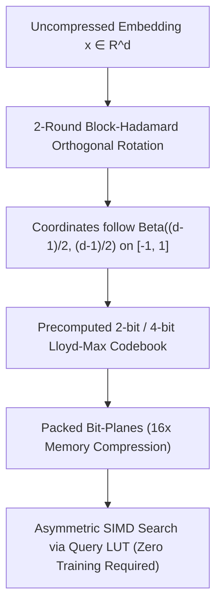

# Research & Architectural Analysis: TurboQuant & Turbovec

**Date:** September 2, 2026  
**Sources:**
- **TurboQuant Paper**: *Data-Oblivious Vector Quantization with Near-Optimal Distortion* (Google Research & NYU, ICLR 2026, [arXiv:2504.19874](https://arxiv.org/abs/2504.19874))
- **`RyanCodrai/turbovec`**: Fast Rust Vector Index with SIMD (AVX2, AVX-512, NEON) based on TurboQuant ([github.com/RyanCodrai/turbovec](https://github.com/RyanCodrai/turbovec))
- **`tonbistudio/turboquant-pytorch`**: PyTorch reference and tensor quantization experiments

---

## 1. What is TurboQuant & Turbovec?



### The Fundamental Breakthrough
In traditional Vector Quantization (e.g. FAISS Product Quantization `IndexPQ`):
1. You **must collect a large training dataset** and run k-means clustering to build subvector codebooks.
2. If the data distribution shifts or new documents arrive online, the codebook becomes stale and recall degrades.
3. Computing distances requires multi-dimensional table lookups with non-trivial memory bandwidth.

**TurboQuant solves this with Data-Oblivious Quantization**:
1. **No Training Required**: It applies a fast, deterministic **Orthogonal Randomized Walsh-Hadamard Transform** (2 rounds of permutation + sign-flips + block-Hadamard).
2. **Universal Coordinate Distribution**: By the spherical Central Limit Theorem, after the orthogonal rotation, every coordinate of a unit vector $u \in \mathbb{S}^{d-1}$ **analytically follows a symmetric Beta distribution** $\text{Beta}\left(\frac{d-1}{2}, \frac{d-1}{2}\right)$ on $[-1, 1]$.
3. **Precomputed Analytical Lloyd-Max Codebook**: Because the distribution depends *only on dimension $d$*, optimal decision boundaries and centroids are computed upfront with zero training data.
4. **Extreme 16x Compression**:
   - 1536-dim vector: **6,144 bytes (FP32)** $\to$ **768 bytes (4-bit)** $\to$ **384 bytes (2-bit)**.
   - 10,000,000 documents: **31 GB of RAM** $\to$ **4 GB of RAM**!

---

## 2. Core Architectural Components in `turbovec` (Rust)

### A. Deterministic Block-Hadamard Rotation (`rotation.rs`)
- Uses ChaCha8 PRNG with a fixed seed (e.g. `seed_from_u64(42)`) to generate:
  1. Global Fisher-Yates coordinate permutation.
  2. $\pm 1$ coordinate sign-flips.
  3. In-place normalized Fast Walsh-Hadamard Transform (FWHT, $\times \frac{1}{\sqrt{B}}$) across blocks of size $B \in \{8, 16, \dots, 512\}$.
- **Complexity**: $O(d \log B)$ in-place operations with zero matrix multiplications.

### B. Analytical Lloyd-Max Codebook (`codebook.rs`)
- Solves 1D Lloyd-Max quantization on $\text{Beta}\left(\frac{d-1}{2}, \frac{d-1}{2}\right)$ using numerical integration.
- For 4-bit (16 levels) or 2-bit (4 levels), it outputs exact boundary thresholds and centroid reconstruction values.

### C. Asymmetric SIMD Search (`search.rs`)
- **Query Processing**: Query vector $q$ is rotated once in $O(d \log B)$.
- **Query LUT**: Precomputes $q_i \times \text{centroid}_c$ for all 16 levels.
- **SIMD Scoring**: Scans packed database vectors using AVX2 / AVX-512 / NEON table lookups (`_mm256_shuffle_epi8` / `vpshufb`) and accumulate dot products directly without dequantizing vectors to RAM.

---

## 3. How Can TurboQuant & Turbovec Help Mivi-v4?

We have identified **3 high-impact areas** where TurboQuant directly supercharges Mivi:

---

### Area 1: Ultra-Compact Semantic Long-Term Memory (`mivi-memory`) 🧠
**Current State in Mivi**:
- `mivi-memory` stores Open Knowledge Format (OKF) markdown records with text metadata, tags, and importance scores.
- When scaling to thousands of conversation turns, workspace code files, and agent episodic memories, dense embedding search in pure FP32 uses substantial RAM.

**TurboQuant Supercharge**:
- Integrate a native `TurboMemoryIndex` inside `mivi-memory`.
- Store 100,000 memory embeddings in just **38 MB of RAM** (at 2-bit/4-bit).
- Enable instant sub-millisecond semantic recall (`find_relevant_memories(query, k)`) with **zero background training phases**.

```rust
// Proposed in crates/mivi-memory/src/index.rs
pub struct TurboMemoryIndex {
    dim: usize,
    bit_width: usize, // 2 or 4 bits
    centroids: Vec<f32>,
    boundaries: Vec<f32>,
    records: Vec<(Uuid, PackedVector)>,
}
```

---

### Area 2: High-Speed Context VM Working Memory Retrieval (`mivi-context`) ⚡
**Current State in Mivi**:
- `mivi-context::ContextStore` uses substring search and keyword matching across active context blocks.
- When searching across 100+ loaded code files or large conversation histories, exact keyword matching misses semantic synonyms (e.g. searching "database connection" fails to find "sql_pool_init").

**TurboQuant Supercharge**:
- Add **Semantic Dense Context Search** to `ContextVM`.
- The agent can search its active context workspace using dense similarity with 4-bit quantized embeddings.
- Filter candidate blocks with allowlists (e.g. filter by active file tags or memory types) directly inside the SIMD scanning loop.

---

### Area 3: Data-Oblivious 2-Bit/4-Bit Attention Key Compression (`mivi-kv`) 💾
**Current State in Mivi (`v0.2.8`)**:
- We currently support `Q8_0` KV cache (8-bit quantization with `f16` scale), achieving a **73.4% RAM reduction**.
- Key vectors have high-magnitude outlier channels that prevent naive 2-bit quantization from retaining high recall.

**TurboQuant Supercharge**:
- By applying a **2-round Block-Hadamard rotation to Key vectors before caching**, outlier channels are evenly dispersed across all dimensions!
- Coordinates become Gaussian/Beta distributed, allowing **lossless 2-bit and 4-bit Key-Value quantization**:
  - **FP32 64K Context**: 1.61 GB
  - **Q8_0 64K Context (Current `v0.2.8`)**: 427 MB
  - **TurboQuant 4-bit 64K Context**: **213 MB**
  - **TurboQuant 2-bit 64K Context**: **106 MB (93.4% RAM reduction!)**

---

## 4. Comparison Summary

| Metric | Standard Float32 | FAISS IndexPQ | TurboQuant / Turbovec |
|---|---|---|---|
| **Memory per 1536-dim vector** | 6,144 bytes | 768 bytes | **384 – 768 bytes** |
| **Training Step** | None | Required (k-means) | **Zero (Data-Oblivious)** |
| **Online Dynamic Vector Insertion** | Trivial | Degrades / Needs Retrain | **Instant & Lossless** |
| **SIMD Acceleration** | FMA GEMV | Cache-bound LUT | **AVX2 / NEON in-register LUT** |
| **Suitability for Local AI Agents** | Medium (RAM hungry) | Poor (Training overhead) | **Perfect (Instant, 4 GB for 10M docs)** |

---

## 5. Recommended Next Step for Mivi-v4

We recommend integrating **TurboQuant vector quantization** directly into **`mivi-memory`** and **`mivi-context`**:
1. Implement pure Rust `TurboQuantEngine` with fast Walsh-Hadamard rotation and precomputed Beta codebooks.
2. Provide sub-millisecond semantic search for agent memory records and context blocks with a tiny memory footprint.
